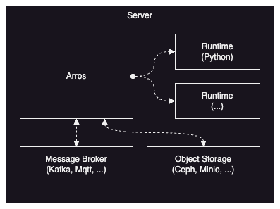

Arros (Arrow Streaming) 는 SQL 을 이용하여 실시간으로 빅데이터를 처리하는 기능을 제공하는, 최근 빅데이터 분야에서 널리 사용되고 있는 [Arrow](https://arrow.apache.org/) 를 이용하여 Rust 기반으로 개발 중인 스트리밍 엔진이다. 이는 기존의 Java/Scala 기반의 [Spark](https://spark.apache.org/) 와 [Flink](https://flink.apache.org/) 를 대체하는 기술로, 적은 자원으로 빅데이터에 준하는 데이터를 실시간으로 처리하기 위해 개발되었다. 오늘은 우리가 Arros 를 왜 개발하였는지, 그리고 어떻게 개발하였고 어떻게 사용하는지에 대해 살펴보도록 하겠다.

## 왜 개발하였나?

우리는 제조 현장의 생산 시설이나 자동차, 로봇 등으로부터 수집되는 데이터를 실시간으로 빠르게 처리하는 것을 목표로 하고 있기 때문에 기존의 빅데이터를 수집/처리하는 분야와는 많은 부분에서 차이가 있다. 이러한 환경에서는 클라우드나 IDC 로 데이터를 보내서 처리한 결과를 받는 것은 현실적으로 불가능하기 때문에 주로 현장이나 수집 장치 가까이 설치된 엣지 서버에서 실시간으로 데이터를 처리한다. 그래서 무엇보다 적은 자원으로 데이터를 빠르게 처리하는 것이 중요하고, 설치 및 관리가 용이해야 한다.

실시간으로 빅데이터를 처리할 때 주로 사용되는 Spark 와 Flink 가 가지는 문제점에 대해 조금 더 살펴보도록 하자.

### 설치/운영

Spark 와 Flink 는 대규모 클러스터 환경에서 빅데이터를 실시간 혹은 배치로 처리하기 위해 개발되었기 때문에 설치와 운영에 높은 전문 지식과 노력이 필요하다. 이러한 방식은 대규모 클러스터를 운영하는 별도의 팀이 있는 IT 기업에는 적합하지만, 여러 사이트에서 독립적으로 동작하는 엣지 서버를 효율적으로 운영하기에는 적합하지 않다.

### 데이터 구조

Spark 와 Flink 는 기본적으로 Row 기반으로 동작하기 때문에 Column 단위로 분석하는 요청에서는 효율이 떨어진다. 이러한 문제를 해결하기 위해 C++ 를 이용하여 Column 기반의 [새로운 엔진](https://www.databricks.com/product/photon)이 개발되고 했지만, 아직은 상용 서비스에서만 사용할 수 있다.

### 메모리 관리

Java 에서 메모리 관리를 도와주는 GC (Garbage Collection) 는 다양한 문제를 유발한다. GC 가 동작할 때마다 시스템 자원을 낭비하고 예측할 수 없는 지연시간을 발생시키기도 하며, 예상하기 힘든 OOM (Out-Of-Memory) 의 원인이 되기도 한다. 그리고 CXL 과 같은 차세대 메모리를 이용하여 시스템 메모리를 늘려도 Java 에서 마음대로 힙(Heap)의 크기를 늘리기 힘든 문제가 있다. (힙의 크기가 늘어나는 만큼 GC 에 의해 관리되는 영역도 늘어나기 때문이다.)

## 어떻게 개발하였나?

우리는 위의 문제들을 해결하기 위해 [Rust](https://www.rust-lang.org/) 와 [Datafusion](https://datafusion.apache.org/) 을 이용하여 Arros 를 개발하고 있다. 높은 안정성과 성능이 요구되는 분야에서 Rust 는 이미 두각을 보이고 있으며, Datafusion 도 오픈소스로 개발 중인 쿼리 엔진으로 이미 다양한 프로젝트에서 좋은 성과를 내고 있다.

이러한 방식으로 기존의 문제점들을 어떻게 해결 및 개선하였는지 간단히 살펴보도록 하자.

### 설치/운영

Arros 는 한 대의 서버에서도 충분히 큰 데이터를 빠르게 처리할 수 있기 때문에 여러 환경에서 독립적으로 동작하는 엣지 서버에 적합하다. 그리고 안정성이나 확장성이 필요하다면 여러 대의 서버로 확장하는 것 또한 가능하기 때문에 상황에 따라 유연하게 대처할 수 있다. 그리고 서버 한 대에서 사용할 수 있는 코어와 메모리가 늘어날수록 처리할 수 있는 데이터는 지속적으로 커질 것이다.

### 데이터 구조

Datafusion 은 기본적으로 Column 기반으로 동작하기 때문에 Column 기반으로 저장된 데이터(Parquet)를 Column 단위로 분석하는 환경에서 매우 유리하다. 여기에 Column 기반의 네트워크 프로토콜인 [FlightSQL](https://arrow.apache.org/docs/format/FlightSql.html#) 까지 사용한다면 불필요한 데이터 구조 변경없이 빅데이터를 효율적으로 처리해서 전달할 수 있게 된다.

### 메모리 관리

Rust 는 GC 없이 메모리 안정성을 보장하기 때문에 필요한 만큼 시스템 메모리를 사용할 수 있고, 스왑 메모리도 효과적으로 사용할 수 있어서 Java 에 비해 훨씬 편리하고 안정적으로 메모리를 관리할 수 있다. Java 는 GC 에 의해 메모리를 지속적으로 정리하지 않으면 예기치 못한 OOM 이 발생하지만, Rust 는 커널이 직접 제공하는 스왑 기능 덕분에 충분한 시스템 메모리와 스왑 메모리만 있다면 OOM 은 발생하지 않는다.

아래는 Arros 를 기반으로 간단히 엣지 서버를 구성한 모습이다. Arros 는 Spark 와 유사한 방식으로 동작하며, 메세지 브로커나 다른 소스로부터 데이터를 수신하여 처리한 다음, 메세지 브로커나 스토리지 등으로 데이터를 송신/저장하는 역할을 담당하고 있다.



Arros 에서는 SQL 을 이용하여 파이프라인을 구성할 수 있고, AI 추론과 같은 복잡한 기능은 UDF (User-Defined Function) 를 이용하여 사용할 수 있다. 예를 들어, 파이썬으로 구현된 AI 추론 기능을 UDF 로 등록하면 파이프라인이 실행되는 과정 중에 외부 런타임(Runtime)에서 해당 기능이 실행된다.

## 어떻게 사용하는가?

몇 가지 예제를 통해 Arros 의 사용법을 소개하도록 하겠다. 아래 예제는 [Arros](https://github.com/ingkle-oss/arros) 에 공개되어 있으니 참고하기 바란다.

우선, docker-compose 를 이용해 Arros 와 Arros 를 구동시키기 위해 필요한 몇 가지 서비스를 실행할 수 있다.

```bash
docker-compose up
```

이제 Arros 를 사용하기 위한 준비는 끝났으니, 예제를 하나씩 살펴보도록 하자.

### Count

Count 예제는 입력 데이터가 몇 개의 행(Row)으로 구성되어있는지 계산해주는 간단한 예제이다. 우선 여기에 사용된 UDF 는 아래와 같다.

```python
__arros__results = [len(__arros__column0)]
```

Arros 에서는 UDF 에 입력값으로 전달되는 컬럼(Column)이나 스칼라(Scalar)를 순서대로 `__arros__columnN` 변수로 전달한다. 그리고 UDF 에서 `__arros__results` 변수에 저장한 값은 Arros 에서 결과값으로 사용된다.

이제 SQL 을 이용하여 간단한 파이프라인을 구성해보자.

```sql
DROP TABLE IF EXISTS faker0;
DROP TABLE IF EXISTS buffer0;
CREATE UNBOUNDED EXTERNAL TABLE faker0 (t0 timestamp, i0 int, f0 float, s0 varchar) STORED AS FAKER WITH ORDER (s0 ASC) LOCATION 'faker0' OPTIONS ('messages' '100', 'interval' '100ms', 'batchsize' '1');
CREATE FUNCTION count(int) RETURNS bigint AS 'count';
CREATE UNBOUNDED EXTERNAL TABLE buffer0 (t0 timestamp, i0 bigint) STORED AS BUFFER location 'buffer0';
INSERT INTO buffer0 SELECT tumble(t0, '3s', '100ms'), count(i0) FROM faker0;
```

위의 파이프라인에서 `faker` 테이블은 지정된 스키마로 임의의 데이터를 생성해주는 역할을 하고, `buffer` 테이블은 데이터를 임시로 보관하는 역할을 한다. 그리고 tumble() 함수는 Arros 가 제공하는 윈도우 기능으로 첫 번째 입력값이 기준이 되는 타임스탬프(Timestamp) 컬럼이고, 두 번째와 세 번째 입력값은 각각 윈도우와 워터마크의 크기를 의미한다. 즉, 위의 파이프라인은 임의로 생성된 3초 동안의 데이터를 묶어서 count() 함수를 호출하는 예제이다. (Arros 를 이용하여 해당 예제를 실행해보는 방법은 [README.md](https://github.com/ingkle-oss/arros/tree/main/simple#readme) 를 참고하기 바란다.)

### Delta

Delta 예제는 입력 데이터를 Minio(S3) 에 [Delta](https://delta.io/) 포맷으로 저장하는 예제이다. 아래는 SQL 을 이용하여 파이프라인을 구성한 것이다.

```sql
DROP TABLE IF EXISTS faker0;
DROP TABLE IF EXISTS delta0;
CREATE UNBOUNDED EXTERNAL TABLE faker0 (t0 timestamp, i0 int, f0 float, s0 varchar) STORED AS FAKER WITH ORDER (s0 ASC) LOCATION 'faker0' OPTIONS ('messages' '10000', 'interval' '100ms', 'batchsize' '10');
CREATE EXTERNAL TABLE delta0 (d0 date not null, i0 int, f0 float, s0 varchar) STORED AS DELTASINK LOCATION 's3://delta' PARTITIONED BY (d0) OPTIONS ('commit_interval' '3s', 'checkpoint_interval' '10');
INSERT INTO delta0 (d0, i0, f0, s0) SELECT CAST(t0 as date), i0, f0, s0 FROM faker0;
```

위의 파이프라인에서 `deltasink` 테이블은 지정된 위치(s3://delta)에 Delta 포맷으로 데이터를 파티셔닝(d0)하여 저장하는 역할을 한다.

### ONNX
