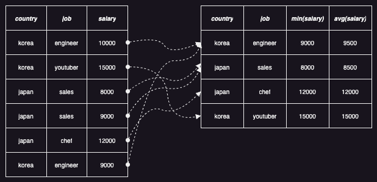
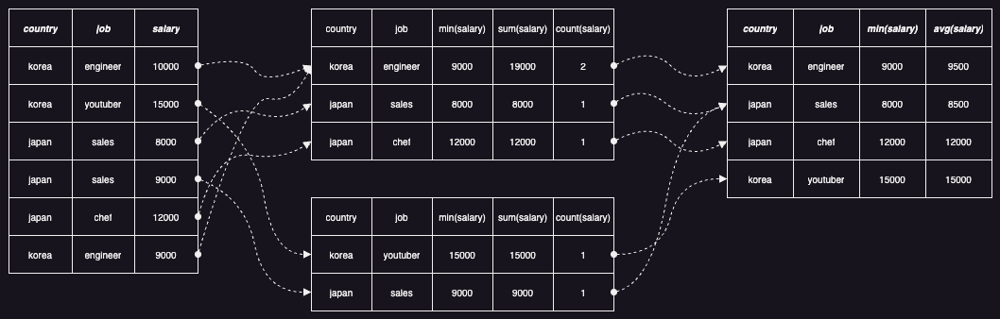
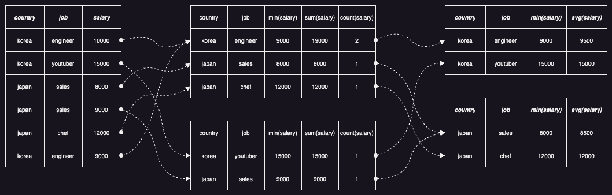

데이터를 분석할 때 가장 많이 사용하는 기능은 집계일 것이다. 특히, 시계열 데이터를 분석할 때는 시간대별 통계를 자주 사용하기 때문에 무엇보다 집계의 성능이 중요하다. 그래서 오늘은 Datafusion 에서 이러한 집계가 어떤 과정으로 이루어지는지, 그리고 어떤 방법으로 최적화하는지 살펴보도록 하자.

간단한 집계를 위한 SQL 쿼리를 실행해보자. 아래는 국가별/직업별 최소 수입과 평균 수입을 구하는 쿼리이다.

```sql
select country, job, min(salary), avg(salary) from table group by country, job
```

위의 쿼리는 아래와 같은 논리 계획으로 변환된다.

```
Aggregate: groupBy=[[table.country, table.job]], aggr=[[min(table.salary), avg(CAST(table.salary AS Float64))]]
  TableScan: table projection=[country, job, salary]
```

위의 논리 계획은 테이블에서 세 개의 컬럼[country, job, salary]을 읽어서 두 개의 컬럼[country, job]으로 그룹핑(grouping)한 다음, 그룹별 최소 수입[min(salary)]과 평균 수입[avg(salary)]을 구하는 것이다. 위의 논리 계획은 아래와 같은 실행 계획으로 변환된다.

```
AggregateExec: mode=Single, gby=[country@0 as country, job@1 as job], aggr=[min(table.salary), avg(table.salary)]
  CsvExec: file_groups={1 group: [[salary.csv]]}, projection=[country, job, salary], has_header=true
```

위의 실행 계획은 데이터(CSV) 파일을 읽는 **CsvExec** 실행 계획과 모든 입력을 받아서 집계를 구하는 **AggregateExec** 실행 계획으로 구성되어 있다. AggregateExec 실행 계획에서 집계를 구하는 방식은 아래 그림처럼 전달받은 모든 데이터를 그룹핑한 후 최소 수입과 평균 수입을 계산하는 것이다.



위의 실행 계획은 어떤 문제를 가지고 있을까? 입력 데이터의 크기가 커지면 하나의 파티션에서 모든 작업을 처리하는 것은 굉장히 오래 걸릴 것이다. 그렇다면 이를 나누어서 처리할 수 있는 방법은 없을까? 이를 해결하기 위해 Datafusion 은 최종 집계를 하기 전에 부분 집계를 하는 방식을 제공하고 있다. (대부분의 SQL 엔진이 비슷한 기능을 제공하고 있다.) 아래는 두 개의 파티션을 사용하도록 설정했을 때의 실행 계획이다.

```
AggregateExec: mode=Final, gby=[country@0 as country, job@1 as job], aggr=[min(table.salary), avg(table.salary)]
  CoalescePartitionsExec
    AggregateExec: mode=Partial, gby=[country@0 as country, job@1 as job], aggr=[min(table.salary), avg(table.salary)]
      RepartitionExec: partitioning=RoundRobinBatch(2), input_partitions=1
        CsvExec: file_groups={1 group: [[salary.csv]]}, projection=[country, job, salary], has_header=true
```

위의 실행 계획은 데이터 파일을 읽어서 라운드로빈 방식으로 두 개의 파티션으로 나눈 다음 각각 부분 집계를 구하고, 이를 하나의 파티션으로 합친 다음 최종 집계를 구한다. 아래 그림을 보면 중간에 부분 집계 결과를 볼 수 있다. (최소값의 부분 집계는 최소값이지만, 평균값의 부분 집계는 합과 개수이고 최종 집계에서 합을 개수로 나누어서 평균값을 구한다.)



위의 실행 계획은 어떤 문제를 가지고 있을까? 부분 집계를 병렬로 구하는 것은 좋지만, 최종 집계를 하나의 파티션으로 처리하는 것은 아쉬워보인다. Datafusion 에서 이를 어떻게 개선하는지 아래 실행 계획을 보면서 분석해보자.

```
AggregateExec: mode=FinalPartitioned, gby=[country@0 as country, job@1 as job], aggr=[min(table.salary), avg(table.salary)]
  RepartitionExec: partitioning=Hash([country@0, job@1], 2), input_partitions=2
    AggregateExec: mode=Partial, gby=[country@0 as country, job@1 as job], aggr=[min(table.salary), avg(table.salary)]
      RepartitionExec: partitioning=RoundRobinBatch(2), input_partitions=1
        CsvExec: file_groups={1 group: [[salary.csv]]}, projection=[country, job, salary], has_header=true
```

위의 실행 계획을 보면, 두 개의 파티션으로 부분 집계롤 구하는 것까진 동일하다. 하지만 두 개의 컬럼[country, job]의 해시를 이용하여 파티션이 재분배되는 부분이 추가되었고, 이를 통해 다른 파티션에 존재하는 같은 그룹[country, job]의 부분 집계를 같은 파티션으로 모아서 최종 집계를 구할 수 있게 된다.



이렇게 부분 집계를 구한 다음 최종 집계를 구하는 것이 항상 좋은 성능을 보여줄까? 그렇지는 않다. 위의 예제를 보더라도, 입력값의 개수는 6 개인데, 부분 집계가 5 개이고 최종 집계가 4 개이다. 이런 경우라면 부분 집계를 구하지 않고 바로 최종 집계를 구하는 것이 좋지 않을까? 어떤 방식이 좋을지는 입력 데이터에 굉장히 의존적이기 때문에 Datafusion 에서는 부분 집계를 구하는 동안 주기적으로 여러 가지 상황을 체크해서 부분 집계를 구하는 것을 중단할지를 판단한다. 예를 들어 그룹의 개수와 입력값의 개수를 비교하여 일정 비율이 넘으면 부분 집계를 중단시키는 것이 가능하다. (그룹의 개수가 많아질수록 그룹당 하나씩 생성되는 Accumulator 가 많아지는데 그룹당 누산되는 입력값의 개수가 적기 때문에 효율이 굉장히 떨어진다.)

스트리밍 데이터에 대한 집계를 구하는 것도 가능한데, 일반적인 집계는 사용할 수 없고 부분 혹은 전체 정렬된 그룹에 대해서만 집계를 구할 수 있다. 데이터가 끝없이 들어오더라도 그룹이 정렬되어 있다면 다음 그룹이 들어오기 시작할때부터는 이전 그룹은 더 이상 새로운 입력값이 들어오지 않는 것이 보장되기 때문이다.

지금까지 Datafusion 이 집계를 어떻게 구하는지 살펴보았다. 이외에도 다양하게 기능들을 제공하고 있으니 본인이 다루고 있는 데이터의 특성과 환경에 맞게 설정해서 사용하는 것이 중요하다.
