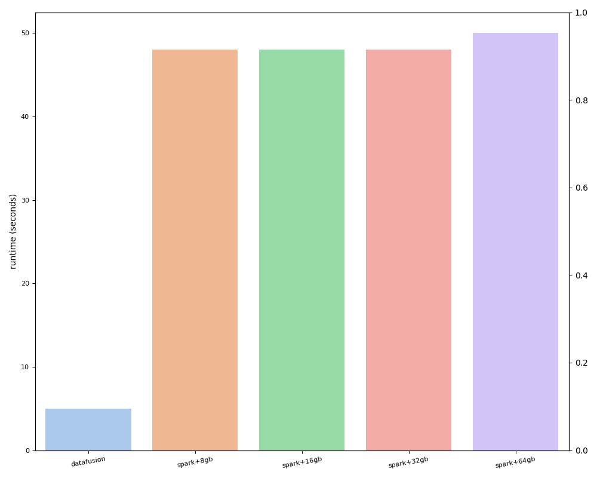
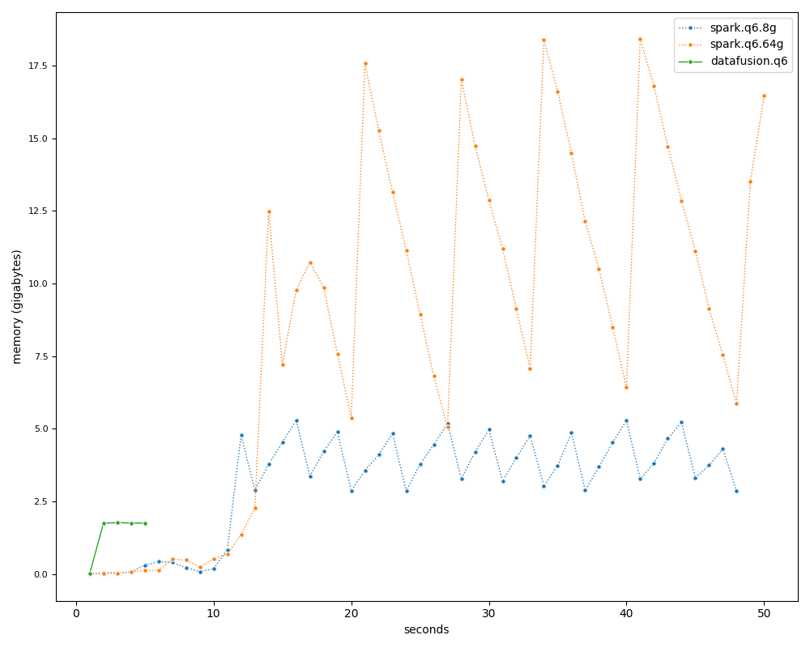

[Datafusion](https://github.com/apache/datafusion) 은 [Arrow](https://arrow.apache.org) 를 이용하여 Rust 기반으로 개발 중인 임베딩 SQL 엔진이다. 그래서 Scala 기반으로 개발되어 JVM 위에서 동작하는 [Spark](https://spark.apache.org) 에 비해 아래와 같은 장점을 가진다.

* Column 기반 데이터 처리 (Arrow)
* GC 없이 메모리 안정성 보장
* LLVM 기반 최적화 (Vectorization, ...)

그렇다면 이러한 장점들이 실제 성능에는 얼마나 영향을 주는지 알아보도록 하자. 오늘은 단일 머신에서의 성능만을 비교하고, 추후에 [Ballista](https://datafusion.apache.org/ballista) 와 같은 Datafusion 기반의 분산 처리 기술을 이용하여 분산 처리 성능도 비교해보도록 하겠다.

실험은 OLAP 성능 검증을 위해 자주 사용되는 TPC-H (SF1000) 를 이용하였다. 실험 결과는 처리 시간과 메모리 사용량을 이용하여 분석하였으며, 최대 메모리 사용량(JVM)에 영향을 많이 받는 Spark 는 8 ~ 64 GB 까지 최대 메모리 사용량을 변경해가면서 성능을 측정하였다.

첫 번째 실험은 하나의 테이블에서 몇 가지 조건절을 이용하여 데이터를 필터링한 다음 합계를 구하는 쿼리(TPC-H-Q6)이다.

```sql
select
    sum(l_extendedprice * l_discount) as revenue
from
    lineitem
where
    l_shipdate >= date '1994-01-01'
    and l_shipdate < date '1995-01-01'
    and l_discount between 0.06 - 0.01 and 0.06 + 0.01
    and l_quantity < 24;
```

아래는 처리 시간을 보여주고 있다. Datafusion 이 Spark 에 비해 대략 10 배 정도 좋은 성능을 보여주고 있다.



아래는 실제 메모리 사용량을 측정한 결과이다. Datafusion 은 최대 1.8 GB 정도의 메모리를 사용하였으며, Spark 는 최대 메모리 사용량이 클수록 메모리 사용량이 증가하면서 오히려 성능이 약간 떨어지는 모습을 볼 수 있다. Spark 는 중간 결과나 재활용될 수 있는 데이터를 메모리에 최대한 유지하는 정책을 취하기 때문에 메모리 사용량은 증가하지만, 이러한 정책이 오히려 GC(GarbageCollection) 오버헤드를 증가시키는 등 안 좋은 결과를 보여줄 수도 있다. (최대 메모리 사용량이 8 GB 일때는 GC 에 1.5 초를 소요했지만, 64 GB 일때는 2.4 초를 소요했다.)



두 번째 실험은 하나의 테이블에서 그룹별 집계를 구하는 쿼리(TPC-H-Q1)이다.

```sql
select
    l_returnflag,
    l_linestatus,
    sum(l_quantity) as sum_qty,
    sum(l_extendedprice) as sum_base_price,
    sum(l_extendedprice * (1 - l_discount)) as sum_disc_price,
    sum(l_extendedprice * (1 - l_discount) * (1 + l_tax)) as sum_charge,
    avg(l_quantity) as avg_qty,
    avg(l_extendedprice) as avg_price,
    avg(l_discount) as avg_disc,
    count(*) as count_order
from
    lineitem
where
    l_shipdate <= date '1998-09-02'
group by
    l_returnflag,
    l_linestatus
order by
    l_returnflag,
    l_linestatus;
```

Datafusion 이 Spark 에 비해 대략 10 ~ 12 배 정도 좋은 성능을 보여주고 있다.


Datafusion 은 최대 2 GB 정도의 메모리를 사용하였으며, Spark 는 앞의 실험과 유사한 결과를 보여주지만 그룹별 집계가 메모리 사용량이 많기 때문에 성능이 나빠지는 정도가 훨씬 심해진 것을 볼 수 있다. (최대 메모리 사용량이 8 GB 일때는 GC 에 21 초를 소요했지만, 64 GB 일때는 40 초를 소요했다.)


세 번째 실험은 두 개의 테이블을 조인하는 쿼리(TPC-H-Q12)이다. 등가(Equal) 조인을 처리하는 방식은 BroadcastJoin, HashJoin, SortMergeJoin 등이 있는데, 이번 실험에서는 최적화가 충분치 않은 Datafusion 의 SortMergeJoin 과 데이터 크기가 커서 사용할 수 없는 Spark 의 BroadcastJoin 은 제외하고 진행하였다.

```sql
select
    l_shipmode,
    sum(case
            when o_orderpriority = '1-URGENT'
                or o_orderpriority = '2-HIGH'
                then 1
            else 0
        end) as high_line_count,
    sum(case
            when o_orderpriority <> '1-URGENT'
                and o_orderpriority <> '2-HIGH'
                then 1
            else 0
        end) as low_line_count
from
    lineitem
    join orders on l_orderkey = o_orderkey
where
    l_shipmode in ('MAIL', 'SHIP')
    and l_commitdate < l_receiptdate
    and l_shipdate < l_commitdate
    and l_receiptdate >= date '1994-01-01'
    and l_receiptdate < date '1995-01-01'
group by
    l_shipmode
order by
    l_shipmode;
```

Datafusion 의 BroadcastJoin 이 가장 좋은 성능을 보여주고 있으며, Spark 에 비해 대략 7.6 배 정도 좋은 성능을 보여주고 있다.


Datafusion 은 BroadcastJoin 과 HashJoin 에서 2.5 GB 정도의 메모리를 사용하였으며, Spark 는 HashJoin 에서 메모리가 부족하여 파티션을 두 배(400)로 늘려서 실험하였다.


실험 결과를 종합해보면, Datafusion 이 훨씬 적은 메모리를 사용하면서도 10 배 정도 좋은 성능을 보여주고 있다. 또한, Spark 는 JVM 위에서 동작하기 때문에 최대 메모리 사용량에 따라 메모리 사용량과 처리 시간이 예측하기 힘든 결과를 보여준다.

```rust
pub fn loop_simple(a: &[i32; 8]) -> i32 {
    let mut r: i32 = 0;
    for var in a.iter() {
        r += var;
    }
    r
}
```

```
       0: 48 83 ec 38                   subq  $56, %rsp
       4: 48 89 7c 24 28                movq  %rdi, 40(%rsp)
       9: c7 44 24 0c 00 00 00 00       movl  $0, 12(%rsp)
      11: be 08 00 00 00                movl  $8, %esi
      16: ff 15 00 00 00 00             callq *(%rip)
      1c: 48 89 c7                      movq  %rax, %rdi
      1f: 48 89 d6                      movq  %rdx, %rsi
      22: ff 15 00 00 00 00             callq *(%rip)
      28: 48 89 44 24 10                movq  %rax, 16(%rsp)
      2d: 48 89 54 24 18                movq  %rdx, 24(%rsp)
      32: 48 8d 7c 24 10                leaq  16(%rsp), %rdi
      37: ff 15 00 00 00 00             callq *(%rip)
      3d: 48 89 44 24 20                movq  %rax, 32(%rsp)
      42: 48 8b 54 24 20                movq  32(%rsp), %rdx
      47: b8 01 00 00 00                movl  $1, %eax
      4c: 31 c9                         xorl  %ecx, %ecx
      4e: 48 83 fa 00                   cmpq  $0, %rdx
      52: 48 0f 44 c1                   cmoveq  %rcx, %rax
      56: 48 83 f8 00                   cmpq  $0, %rax
      5a: 75 09                         jne 0x65
      5c: 8b 44 24 0c                   movl  12(%rsp), %eax
      60: 48 83 c4 38                   addq  $56, %rsp
      64: c3                            retq
      65: 48 8b 74 24 20                movq  32(%rsp), %rsi
      6a: 48 89 74 24 30                movq  %rsi, 48(%rsp)
      6f: 48 8d 7c 24 0c                leaq  12(%rsp), %rdi
      74: 48 8d 15 00 00 00 00          leaq  (%rip), %rdx
      7b: e8 00 00 00 00                callq 0x80
      80: eb b0                         jmp 0x32
      ...
```

```
       0: f3 0f 6f 07                   movdqu  (%rdi), %xmm0
       4: f3 0f 6f 4f 10                movdqu  16(%rdi), %xmm1
       9: 66 0f fe c8                   paddd   %xmm0, %xmm1
       d: 66 0f 70 c1 ee                pshufd  $238, %xmm1, %xmm0
      12: 66 0f fe c1                   paddd   %xmm1, %xmm0
      16: 66 0f 70 c8 55                pshufd  $85, %xmm0, %xmm1
      1b: 66 0f fe c8                   paddd   %xmm0, %xmm1
      1f: 66 0f 7e c8                   movd    %xmm1, %eax
      23: c3                            retq
```