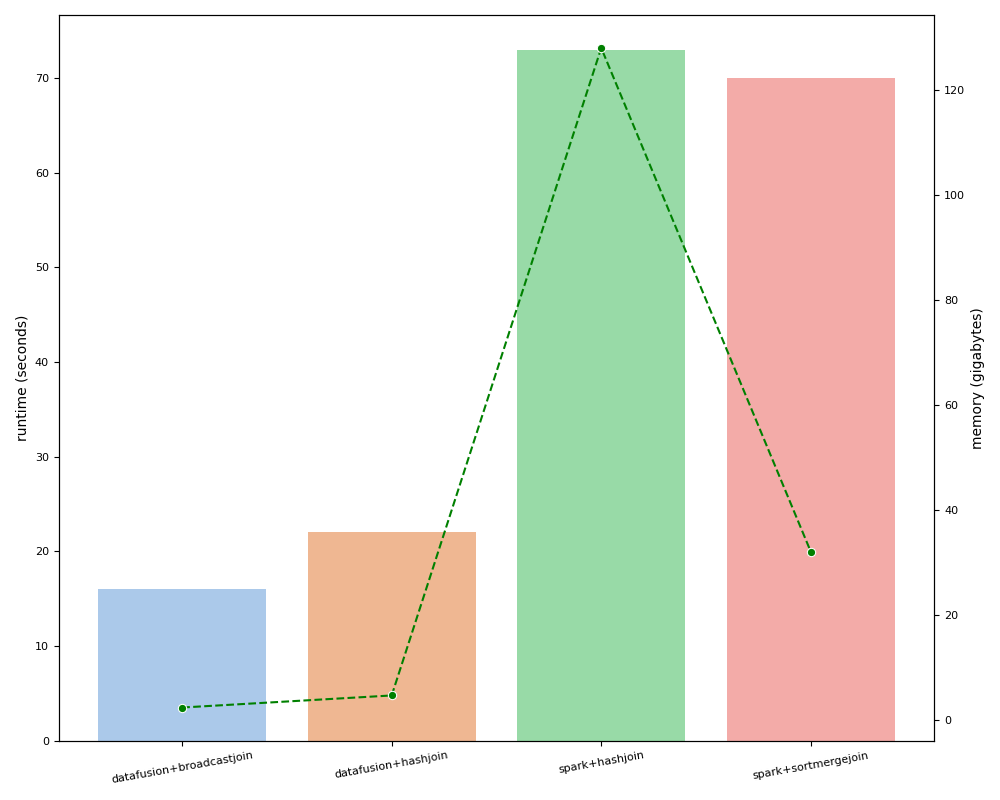

대부분 가장 좋은 성능을 보여주는 방식은 HashJoin 이다. 이는 아래 그림처럼 작은 테이블을 이용하여 해시 테이블을 먼저 만들고, 큰 테이블을 순서대로 비교하면서 처리하는 방식이다. 해시를 이용하기 때문에 큰 테이블에 있는 데이터가 작은 테이블에 있는지 비교하는 비용은 O(1) 이지만, 해시 테이블을 메모리에 유지하는 비용이 문제가 될 수 있다. 그래서 해시 테이블의 크기가 작다면 하나의 해시 테이블을 만드는 방식(Broadcast)을 사용하고, 해시 테이블의 크기가 크다면 등가(Equal) 조건 컬럼으로 파티셔닝한 다음 해시 테이블을 만드는 방식(Shuffle)을 사용한다. 분산 처리 엔진(Spark)에서는 BroadcastHashJoin 을 사용하면 드라이버 노드에서 해시 테이블을 만든 다음 모든 워커 노드로 전송하기 때문에 드라이버 노드의 메모리 크기와 해시 테이블을 전송하는 비용이 문제가 되지만, Datafusion 은 단일 노드(MultiThreading)에서 동작하기 때문에 BroadcastHashJoin 을 사용하더라도 메모리 사용량이 많아지거나 불필요한 메모리 전송이 발생하진 않는다.

