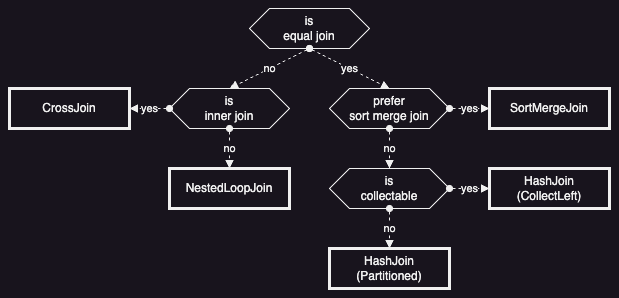

대부분의 SQL 엔진에서 성능 향상을 위해 가장 많이 신경쓰는 부분은 바로 조인(Join)일 것이다. 그래서 다양한 조건의 조인을 처리하는 여러 가지 동작 방식이 존재하고, 다양한 상황을 고려하여 최선의 동작 방식을 선택하는 것이 필수이다. 오늘은 Datafusion 에서 어떤 방식으로 조인을 처리하는지, 어떤 방법으로 최적화하는지 살펴보도록 하자.

조인을 처리하는 방식에 가장 큰 영향을 주는 등가(Equal) 조건의 유무에 따라 조인을 어떻게 처리하는지 살펴보자. 우선 등가 조인을 위한 SQL 쿼리를 실행해보자.

```sql
select * from left inner join right on left.country == right.country and left.job == right.job
```

위와 같이 두 개 컬럼(country, job)에 대한 조건이 추가된 쿼리는 아래와 같은 논리 계획으로 변환된다.

```
Inner Join: left.country = right.country, left.job = right.job
  TableScan: left projection=[country, job, salary]
  TableScan: right projection=[country, job, insurance]
```

등가 조인은 일반적으로 두 가지 방식(HashJoin/SortMergeJoin)으로 처리한다.

대부분 가장 좋은 성능을 보여주는 방식은 HashJoin 이다. 이는 아래 그림처럼 작은 테이블을 이용하여 해시 테이블을 먼저 만들고, 큰 테이블을 순서대로 비교하면서 처리하는 방식이다. 해시를 이용하기 때문에 큰 테이블에 있는 데이터가 작은 테이블에 있는지 비교하는 비용은 O(1) 이지만, 해시 테이블을 메모리에 유지하는 비용이 문제가 될 수 있다. 그래서 해시 테이블의 크기가 작다면 하나의 해시 테이블을 만드는 방식(Broadcast)을 사용하고, 해시 테이블의 크기가 크다면 등가(Equal) 조건 컬럼으로 파티셔닝한 다음 해시 테이블을 만드는 방식(Shuffle)을 사용한다. 분산 처리 엔진(Spark)에서는 BroadcastHashJoin 을 사용하면 드라이버 노드에서 해시 테이블을 만든 다음 모든 워커 노드로 전송하기 때문에 드라이버 노드의 메모리 크기와 해시 테이블을 전송하는 비용이 문제가 되지만, Datafusion 은 단일 노드(MultiThreading)에서 동작하기 때문에 BroadcastHashJoin 을 사용하더라도 메모리 사용량이 많아지거나 불필요한 메모리 전송이 발생하진 않는다.



