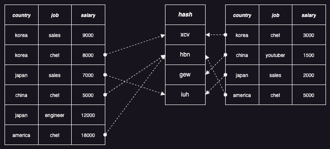
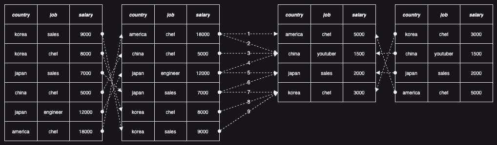
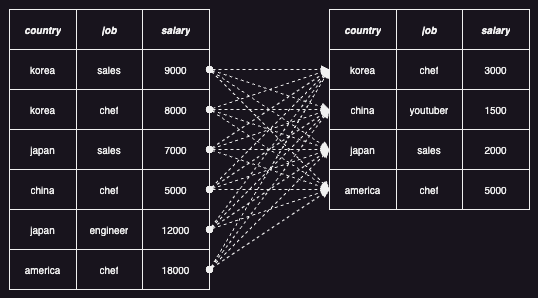

대부분의 SQL 엔진에서 성능 향상을 위해 가장 많이 신경쓰는 부분은 바로 조인(Join)일 것이다. 그래서 다양한 조건의 조인을 처리하는 여러 가지 동작 방식이 존재하고, 다양한 상황을 고려하여 최선의 동작 방식을 선택하는 것이 필수이다. 오늘은 Datafusion 에서 어떤 방식으로 조인을 처리하는지, 어떤 방법으로 최적화되는지 살펴보도록 하자.

조인을 처리하는 방식에 가장 큰 영향을 주는 등가(Equal) 조건의 유무에 따라 조인을 어떻게 처리하는지 살펴보자.

```sql
select * from left inner join right on left.country == right.country and left.job == right.job
```

위의 쿼리는 두 개 컬럼[country, job]에 대한 등가 조건을 포함하고 있고, 아래와 같은 논리 계획으로 변환되어 일반적으로 두 가지 방식(HashJoin/SortMergeJoin)으로 실행된다.

```
Inner Join: left.country = right.country, left.job = right.job
  TableScan: left projection=[country, job, salary]
  TableScan: right projection=[country, job, salary]
```

우선, 대부분 가장 좋은 성능을 보여주는 HashJoin 부터 살펴보자. 이는 아래 그림처럼 작은 테이블을 이용하여 해시 테이블을 먼저 만들고, 큰 테이블을 순서대로 비교하면서 처리하는 방식이다. 해시를 이용하기 때문에 큰 테이블에 있는 데이터가 작은 테이블에 있는지 비교하는 비용은 O(1) 이지만, 해시 테이블을 메모리에 유지하는 비용이 문제가 될 수 있다. 그래서 테이블의 크기가 작다면 하나의 해시 테이블을 만드는 방식(CollectLeft)을 사용하고, 테이블의 크기가 크다면 조건 컬럼[country, job]의 해시를 이용해서 나눈 다음 파티션별로 해시 테이블을 만드는 방식(Partitioned)을 사용한다.



조인에 사용되는 두 개의 테이블 중에 크기가 충분히 작은 테이블이 있다면 아래와 같은 실행 계획으로 변환된다.

```
HashJoinExec: mode=CollectLeft, join_type=Inner, on=[(country@0, country@0), (job@1, job@1)]
  CsvExec: file_groups={1 group: [[left.csv]]}, projection=[country, job, salary], output_ordering=[country@0 ASC NULLS LAST], has_header=true
  RepartitionExec: partitioning=RoundRobinBatch(2), input_partitions=1
    CsvExec: file_groups={1 group: [[right.csv]]}, projection=[country, job, salary], output_ordering=[country@0 ASC NULLS LAST], has_header=true
```

위의 실행 계획은 작은 테이블(left.csv)을 이용하여 해시 테이블을 먼저 만들고, 큰 테이블(right.csv)은 두 개의 파티션으로 나눈 다음 앞에서 만든 해시 테이블을 이용하여 비교한다. 분산 처리 엔진(Spark)은 마스터 노드에서 해시 테이블을 만들어서 워커 노드로 전송하기 때문에 오버헤드가 크지만, Datafusion 은 하나의 프로세스 내에서 간단히 해시 테이블을 공유해서 사용한다.

조인에 사용되는 두 개의 테이블 중에 크기가 충분히 작은 테이블이 없다면 아래와 같은 실행 계획으로 변환된다.

```
HashJoinExec: mode=Partitioned, join_type=Inner, on=[(country@0, country@0), (job@1, job@1)]
  RepartitionExec: partitioning=Hash([country@0, job@1], 2), input_partitions=2
    RepartitionExec: partitioning=RoundRobinBatch(2), input_partitions=1
      CsvExec: file_groups={1 group: [[left.csv]]}, projection=[country, job, salary], output_ordering=[country@0 ASC NULLS LAST], has_header=true
  RepartitionExec: partitioning=Hash([country@0, job@1], 2), input_partitions=2
    RepartitionExec: partitioning=RoundRobinBatch(2), input_partitions=1
      CsvExec: file_groups={1 group: [[right.csv]]}, projection=[country, job, salary], output_ordering=[country@0 ASC NULLS LAST], has_header=true
```

위의 실행 계획은 두 테이블을 각각 두 개의 파티션으로 나눈 다음, 조건 컬럼[country, job]의 해시를 이용하여 파티션을 재분배한다. 이렇게 되면 같은 조건 컬럼을 가지는 두 테이블의 모든 행은 같은 파티션으로 모이기 때문에 파티션별로 해시 테이블을 만들어서 처리하면 된다.

다음으로, SortMergeJoin 을 살펴보자. 이는 아래 그림처럼 두 개의 테이블을 정렬한 다음 순차적으로 비교하면서 처리하는 방식이다. 정렬된 두 개의 테이블이 어떤 순서로 처리되는지 번호로 표시를 해두었다. 원리는 단순한데, 두 개의 테이블을 비교해서 오른쪽 테이블의 행(row)이 크면 왼쪽 테이블의 다음 행으로 넘어가고, 왼쪽 테이블의 행이 크면 오른쪽 테이블의 다음 행으로 넘어간다. 이런 방식으로 하면 빠짐없이 같은 조건 컬럼을 가지는 모든 행의 조합을 찾을 수 있다.



SortMergeJoin 을 사용했을 때의 실행 계획은 아래와 같다.

```
SortMergeJoin: join_type=Inner, on=[(country@0, country@0), (job@1, job@1)]
  SortExec: expr=[country@0 ASC, job@1 ASC], preserve_partitioning=[true]
    RepartitionExec: partitioning=Hash([country@0, job@1], 2), input_partitions=2
      RepartitionExec: partitioning=RoundRobinBatch(2), input_partitions=1
        CsvExec: file_groups={1 group: [[left.csv]]}, projection=[country, job, salary], output_ordering=[country@0 ASC NULLS LAST], has_header=true
  SortExec: expr=[country@0 ASC, job@1 ASC], preserve_partitioning=[true]
    RepartitionExec: partitioning=Hash([country@0, job@1], 2), input_partitions=2
      RepartitionExec: partitioning=RoundRobinBatch(2), input_partitions=1
        CsvExec: file_groups={1 group: [[right.csv]]}, projection=[country, job, salary], output_ordering=[country@0 ASC NULLS LAST], has_header=true
```

위의 실행 계획은 두 테이블을 각각 두 개의 파티션으로 나눈 다음, 조건 컬럼[country, job]의 해시를 이용하여 파티션을 재분배한다. 그리고 파티션별로 졍렬한 다음 순차적으로 비교하면서 처리한다.

아래와 같이 등가 조건이 없는 비등가 조인은 어떻게 처리되는지 살펴보자.

```sql
select * from left inner join right on left.salary > right.salary
```

위의 쿼리는 아래와 같은 논리 계획으로 변환된다.

```
Inner Join:  Filter: left.salary > right.salary
  TableScan: left projection=[country, job, salary]
  TableScan: right projection=[country, job, salary]
```

비등가 조인은 일반적으로 두 가지 방식(NestedLoopJoin/CrossJoin)으로 처리된다. 동작 원리는 간단한데, 아래처럼 두 테이블의 가능한 조합을 모두 확인한다고 보면 된다. 그래서 성능적인 문제가 있기 때문에 꼭 필요할 때만 사용되는 방식이다.



아래는 NestedLoopJoin 을 사용했을 때의 실행 계획이다.

```
NestedLoopJoinExec: join_type=Inner, filter=salary@0 > salary@1
  CsvExec: file_groups={1 group: [[left.csv]]}, projection=[country, job, salary], output_ordering=[country@0 ASC NULLS LAST], has_header=true
  RepartitionExec: partitioning=RoundRobinBatch(2), input_partitions=1
    CsvExec: file_groups={1 group: [[right.csv]]}, projection=[country, job, salary], output_ordering=[country@0 ASC NULLS LAST], has_header=true
```

위의 실행 계획은 큰 테이블(right.csv)을 두 개의 파티션으로 나눈 다음 작은 테이블(left.csv)과 가능한 조합을 모두 확인한다.

지금까지 Datafusion 에서 조인이 어떻게 동작하는지 살펴보았다. 이외에도 다양한 최적화 기술들을 이미 지원하고 있고, 앞으로 지원될 예정인 기술들도 많으니 기회될 때마다 소개드리도록 하겠다.
