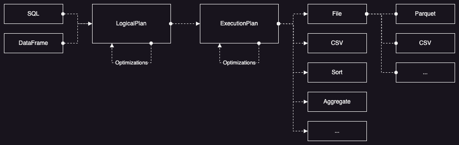

[Datafusion](https://github.com/apache/datafusion) 은 최근 빅데이터 분야에서 널리 사용되고 있는 [Arrow](https://arrow.apache.org/) 를 이용하여 Rust 기반으로 개발 중인 임베딩 SQL 엔진이다. 이미 다양한 분야에서 활용되고 있는 [DuckDB](https://github.com/duckdb/duckdb) 와 유사한 목적을 가지고 있지만, Rust 로 개발 중이기 때문에 메모리 관리가 편리하고 확장성이 굉장히 뛰어나다는 장점이 있다. 이러한 장점들로 인해 최근 Datafusion 을 이용하여 기존 솔루션보다 탁월한 성능을 보여주는 새로운 오픈소스들이 많이 등장하고 있고, 특히 Java/Scala 중심의 빅데이터 분야에서 많은 변화를 주도할 것으로 기대된다. 그럼 이제 Datafusion 에 대해 자세히 살펴보도록 하자.

우선, 오랜 시간 널리 사용되고 있는 Spark 와 비교했을 때 어떤 부분이 차이가 있는지 살펴보도록 하자. (Spark 와 비교하는 이유는, Datafusion 을 Pandas 와 비교할 수도 있겠지만 개인적으로 Spark 의 대체제로 활용하고 있기 때문이다.)

### 설치/운영

Spark 는 대규모 클러스터 환경에서 빅데이터를 처리하기 위해 개발되었기 때문에 설치와 운영에 높은 전문 지식과 노력이 필요하다. 하지만 Datafusion 은 어디서나 임베딩할 수 있기 때문에 비교적 간단하게 사용할 수 있고, 수백대에서 수천대의 대규모 클러스터에서 처리하는 데이터를 처리하긴 힘들지만 수십대의 클러스터에서 처리하는 데이터는 처리할 수 있다. 그리고 서버에 설치할 수 있는 CPU 와 메모리가 늘어날수록 처리할 수 있는 데이터는 지속적으로 늘어날 것이다. (참고로, Datafusion 을 [분산 클러스터 환경에서 사용하려는 시도](https://github.com/apache/datafusion-ray)도 있긴 하다.)

### 데이터 구조

Spark 는 기본적으로 Row 기반으로 동작하기 때문에 Column 단위로 분석하는 요청에서는 효율이 떨어진다. 이러한 문제를 해결하기 위해 C++ 를 이용한 Column 기반의 [새로운 엔진](https://www.databricks.com/product/photon)과 Arrow 기반의 [Velox](https://github.com/facebookincubator/velox) 를 실행 엔진으로 사용하려는 시도가 있지만, 아직 여러 가지 제약 사항이 많다. 하지만 Arrow 기반의 Datafusion 은 Column 단위로 동작하기 때문에 대부분의 분석 쿼리에서 효율적으로 동작한다. 여기에는 연속된 메모리에 대한 반복 처리를 자동으로 Vectorization 해주는 LLVM 의 AutoVectorization 이 큰 역할을 하고 있다.

### 메모리 관리

Java 에서 메모리 관리를 도와주는 GC (Garbage Collection) 는 다양한 문제를 유발한다. GC 가 동작할 때마다 시스템 자원을 낭비하고 예측할 수 없는 지연시간을 발생시키기도 하며, 예상하기 힘든 OOM (Out-Of-Memory) 의 원인이 되기도 한다. 그리고 더 많은 메모리가 필요해서 JVM 이 사용하는 힙(Heap)의 크기를 늘리면 GC 에 의해 관리되는 영역도 늘어나기 때문에 앞서 언급한 문제들이 더욱 심각해질 수 있다. 하지만 Rust 는 GC 없이 메모리 안정성을 보장하기 때문에 필요한 만큼 시스템 메모리를 사용할 수 있고, 스왑 메모리도 효과적으로 사용할 수 있다. Java 는 GC 에 의해 메모리를 적절히 정리하지 않으면 예기치 못한 OOM 이 발생하지만, Rust 는 커널이 직접 제공하는 스왑 기능 덕분에 충분한 시스템 메모리와 스왑 메모리만 있다면 OOM 은 발생하지 않는다.

### 실행 방식

Java 는 바이트 코드로 컴파일되어 배포되기 때문에 성능을 높이기 위해 JIT (Just-In-Time) 방식을 사용하고 있다. 이는 자주 실행되는 바이트 코드를 런타임에 컴파일하여 네이티브 코드(x86, arm, ...)로 변환하는 기술인데, 이를 위한 준비 과정이 필요하며 LLVM 과 같은 컴파일러에 비해 충분한 최적화가 이루어지지 않는 문제가 있다. 하지만 Rust 는 네이티브 코드로 컴파일되어 배포되기 때문에 LLVM 이 제공하는 높은 수준의 최적화를 충분히 활용하게 된다.

