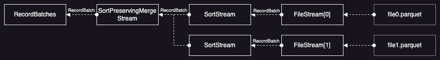

[Datafusion](https://github.com/apache/datafusion) 은 최근 빅데이터 분야에서 널리 사용되고 있는 [Arrow](https://arrow.apache.org/) 를 이용하여 Rust 기반으로 개발 중인 임베딩 SQL 엔진이다. 이미 다양한 분야에서 활용되고 있는 [DuckDB](https://github.com/duckdb/duckdb) 와 유사한 목적을 가지고 있지만, Rust 로 개발한 부분과 확장성이 뛰어난 부분 때문에 개인적으로 Datafusion 을 여러 가지 용도로 활용하고 있다. 그리고 최근 Rust 와 Datafusion 을 이용하여 기존 솔루션에 비해 탁월한 성능을 보여주는 새로운 오픈소스들이 많이 등장하고 있기 때문에 Datafusion 에 대해 자세히 분석해보는 시간을 가지려고 한다.

