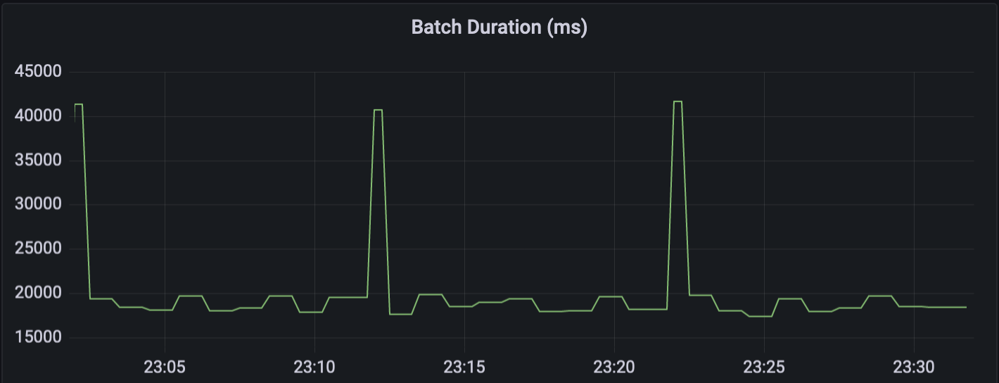
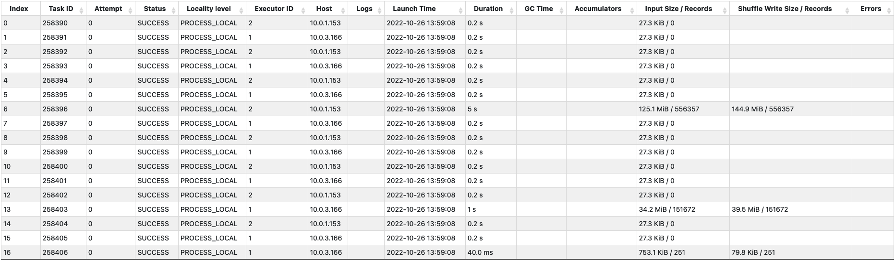
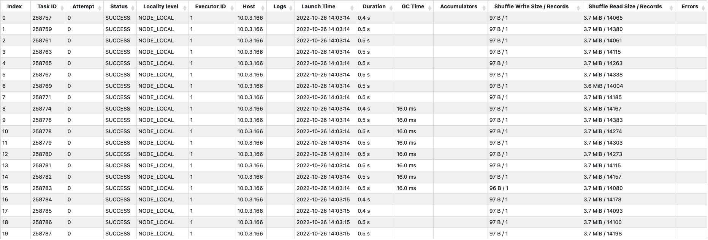

스파크를 이용하여 스트리밍 데이터를 델타레이크로 저장할 때 체크포인트가 읽기/쓰기 성능에 어떠한 영향을 미치는지 살펴보고, 이를 개선할 수 있는 멀티파트 체크포인트 기능에 대해 알아보도록 하자.
(아래의 실험 환경은 모두 마이크로 배치 간격이 1 분으로 설정되어 있다.)

위의 그래프는 실험 환경에서 스파크 스트리밍의 마이크로 배치 처리시간을 시간순으로 보여주고 있다. 마이크로 배치에서는 특별한 작업없이 바로 (델타) 테이블에 저장하기 때문에 대부분의 처리시간은 저장하는데 소요된다. 그리고 중간에 반복적으로 한번씩 튀는 것은 델타레이크에서 10 번의 쓰기 작업마다 새로운 체크포인트 파일을 만들기 때문이다. (배치 간격이 1 분이기 때문에 대략 10 분에 한번씩 그래프가 튀는 것을 볼 수 있다.) 그럼 이제 스트리밍 데이터를 처리한 후, 테이블에 저장하는 과정을 자세히 분석해보도록 하자.

먼저, 델타레이크는 테이블의 현재 상태를 유지하기 위해 쓰기 작업이 끝날 때마다 (델타로그) 스냅샷을 갱신해야 한다. 이를 위해 마지막 체크포인트 파일과 이후의 로그 파일들을 이용하여 스냅샷에서 사용하는 (스파크) 데이터프레임을 만든다. 델타레이크는 체크포인트 파일을 위한 FileScanRDD 와 로그 파일들을 위한 FileScanRDD 를 각각 만들어서 파일들을 읽어들인 다음, 하나의 RDD 로 합친 후 설정된 값(기본값 50)으로 리파티셔닝(repartition)한다.
(델타로그도 빅데이터이기 때문에 병렬 처리가 중요하다.)

아래는 체크포인트 파일과 로그 파일들을 읽어서 리파티셔닝을 위한 셔플 쓰기(Shuffle Write)를 하는 스테이지를 보여주고 있다. 17 개의 태스크가 생성되었지만, 제대로 파일을 읽는 태스크는 6 번 125MB, 13 번 34MB, 그리고 16 번 753KB 밖에 없다. 왜 이런 상황이 벌어졌는지 자세히 살펴보자.

우선 왜 17 개의 태스크가 생성되었을까? 스파크에서는 FileScanRDD 가 사용할 파티션을 만들 때, 하나의 파티션에서 읽을 수 있는 파일의 최대 크기를 정하는데 이 때 몇 가지 변수들(maxPartitionBytes, openCostInBytes, ...)과 전체 코어 개수를 사용한다. 해당 실험 환경에서는 이렇게 계산된 최대 파일 크기가 대략 10MB 였고, 그래서 160MB 정도 크기인 체크포인트 파일을 분할하여 읽기 위한 16 개의 파티션과 1 개의 로그 파일을 읽기 위한 1 개의 파티션이 만들어져서 총 17 개의 태스크가 생성되었다.
(마지막 체크포인트 이후 하나의 로그만 생성되었기 때문에 1 개의 로그 파일만 추가로 읽으면 되었다.)

그런데 왜 하나의 로그 파일을 읽는 태스크를 제외하고, 두 개의 태스크만 체크포인트 파일을 읽었을까? 이유는 파케이(Parquet) 포맷을 사용하는 체크포인트 파일의 블럭 크기가 128MB 이기 때문에 2 개의 블럭(125MB, 34MB)만을 가지고 있었고, 그래서 각 블럭의 가운데 지점에 해당하는 태스크인 6 번과 13 번 태스크만이 해당 블럭을 읽었기 때문이다.

이러한 이유로 해당 스테이지에서는 17 개의 태스크를 사용했지만 하나의 태스크가 125MB 를 읽으면서 총 5 초의 시간이 소요되었다.

아래는 50 개의 태스크에서 셔플 읽기(Shuffle Read)를 하는 스테이지를 보여주고 있고, 이후 델타로그와 관련된 연산은 해당 RDD 에서 50 개의 파티션으로 나누어져서 처리된다.

이러한 과정을 통해 일반적인 쓰기 작업은 위의 그래프에서 보면 대략 20 초 정도 걸리는 것을 알 수 있다. 그리고 지금부터는 10 분에 한번씩 쓰기 작업이 40 초 이상 걸리는 이유인, 주기적으로 새로운 체크포인트 파일을 만드는 부분에 대해 자세히 살펴보도록 하자.

새로운 체크포인트 파일을 만드는 부분에서 성능적으로 가장 문제가 되는 것은 위에서 설명한 것처럼 50 개의 파티션으로 나뉘어 처리되던 RDD 를 하나의 체크포인트 파일을 만들기 위해 다시 하나의 파티션을 가지는 RDD 로 합쳐야 한다는 것이다.
