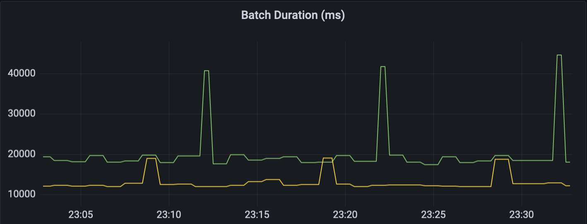

스파크를 이용하여 스트리밍 데이터를 델타레이크로 저장할 때 체크포인트가 읽기/쓰기 성능에 어떠한 영향을 미치는지 살펴보고, 이를 개선할 수 있는 멀티파트 체크포인트 기능에 대해 살펴보도록 하겠다.

위의 그래프는 실험 환경에서 스파크 스트리밍의 마이크로 배치 처리시간을 시간순으로 보여주고 있다. 중간에 반복적으로 한번씩 튀어나오는 것은 10 번의 쓰기 작업마다 새로운 체크포인트 파일을 만들기 때문이다.
