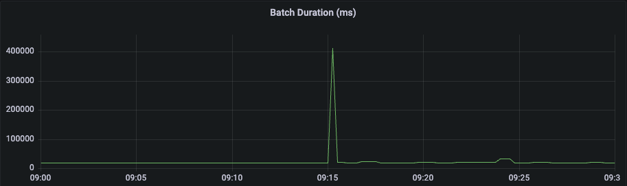
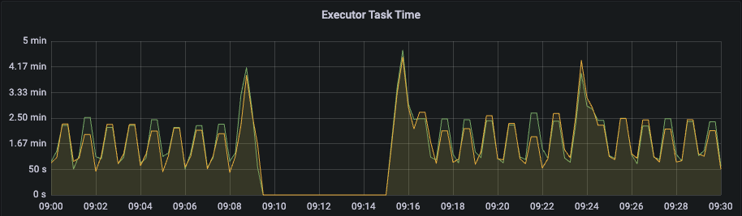

최근 스파크를 이용하여 스트리밍 데이터를 델타레이크로 저장할 때 발생한 문제를 소개하고자 한다. 현재 작업 중인 환경에서는 스파크 스트리밍의 마이크로 배치 처리시간이 평균적으로 일반적인 쓰기 작업은 10 초 내외이고, 10 번의 쓰기 작업마다 새로운 체크포인트 파일을 만들 때는 2~30 초 정도이다. 그런데 주기적으로 새로운 체크포인트 파일을 만들 때 400 초 정도의 시간이 소요되는 문제를 발견하였다. 오늘은 왜 이런 문제가 발생하였는지 살펴보도록 하자.



위의 그래프는 문제 발생 시 배치 처리시간을 보여주고 있다. 보시는 바와 같이 오전 9 시쯤 배치 처리시간이 400 초를 넘어서는 것을 볼 수 있다. 그리고 지난 며칠 간의 데이터를 분석해보니, 매일 같은 시간에 같은 일이 반복되고 있는 것을 알 수 있었다.



위의 그래프는 해당 문제가 발생했을 때 스파크 스트리밍에 사용된 익스큐터(Executor)의 태스크 처리 시간을 보여주고 있다. 현재는 2 개의 익스큐터가 동작 중인데, 해당 시간에만 2 개의 익스큐터 모두 아무런 작업을 하지 않은 것을 볼 수 있다. 이를 통해 스파크 스트리밍에 사용된 드라이버에서 반복적으로 특정 시간에 문제가 발생하는 것을 예상해 볼 수 있다.
(어떤 문제가 규칙성을 보이면, 가비지 컬렉션(Gabage Collection) 혹은 어떠한 자원 경쟁에 의한 문제는 아니라고 볼 수 있다.)

그래서 문제가 발생했을 때의 상황을 이해하기 위해 드라이버의 콘솔 로그를 분석하였고, 결과적으로 아래와 같이 문제의 원인을 파악할 수 있었다. 아래 로그를 보면, 드라이버가 어떠한 작업을 처리하기 위해 400 초 정도의 시간을 보낸 것을 알 수 있다. 이로 인해 다음 마이크로 배치 처리가 지연되면서 모든 익스큐터가 대기 상태가 된 것이다.

```bash
...
09:08:31.398 [INFO] DeltaLog: Starting the deletion of log files older than 30 Oct 2022 00:00:00 GMT
09:14:53.866 [INFO] DeltaLog: Deleted 4242 log files older than 30 Oct 2022 00:00:00 GMT
...
```

그럼 이제 정확히 어떤 작업으로 인해 이러한 문제가 발생했는지 좀 더 알아보도록 하자.

위의 작업은 델타레이크에서 일정 시간(logRetentionDuration)이 지난 로그 파일을 지우는 것이다. 해당 작업은 매일 UTC 기준으로 0 시에 실행되고, 그래서 한국시간으로 오전 9 시쯤 실행된 것이다. 정확히는 UTC 기준으로 0 시가 지나고 처음 체크포인트 파일을 만들 때 해당 작업이 실행된다. 현재 작업 환경에서는 마이크로 배치 간격이 1 분이기 때문에 하루에 생성되는 로그의 개수는 1440 개 정도이고, 체크포인트 파일도 같은 방식으로 지워지기 때문에 해당 작업에서 지워지는 파일의 수는 대략 2~3 천개 정도이다. 즉, 드라이버에서 오브젝트 스토리지에 저장되어 있는 2~3 천개의 파일을 지우는데 대략 400 초 정도의 시간이 소요된다는 말이다.
