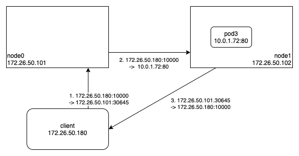

Cilium 에서는 외부에서 쿠버네티스 서비스에 접근할 때 사용되는 NodePort, LoadBalancer 등의 성능을 개선할 수 있는 DSR(Direct Server Return) 기능을 제공한다.

위 그림처럼 DSR 의 목적은 Pod(nginx)의 응답 패킷을 다시 Node0 을 통해 클라이언트로 전달하는 것이 아니고, Node1 에서 바로 클라이언트로 전달하겠다는 것이다.
이를 통해 Node1 에서 Node0 으로 응답 패킷을 전송하는 비용을 줄일 수 있다.

그럼 DSR 을 이용해서 패킷이 전달되는 과정을 좀 더 상세히 살펴보도록 하자.

클라이언트에서 Node0 으로 전송된 패킷은 물리 네트워크 장치의 ingress BPF 프로그램(cilium/bpf/bpf_host.c#from-netdev)에 의해 목적지 주소(172.26.50.101:30645)를 백엔드 주소(10.0.1.72:80)로 변환한다.
(Node0 으로 응답 패킷이 다시 전달되는 것이 아니기 때문에 conntrack 맵에 변환정보를 저장하진 않는다.)
그리고 해당 패킷을 Node1 로 전달하는데, Node1 에서 클라이언트로 응답 패킷을 전달할 때 출발지 주소를 원래 클라이언트가 접속한 주소로 변환하기 위해 원래의 목적지 주소(172.26.50.101:30645)를 IP 의 옵셥(option) 헤더에 추가한다.

Node1 의 물리 네트워크 장치로 수신된 패킷은 Pod(nginx)의 ingress BPF 프로그램(cilium/bpf/bpf_lxc.c#handle_policy)에서 전달받은 IP 의 옵션 헤더에 저장된 원래의 목적지 주소(172.26.50.101:30645)를 cilium_snat_v4_external 맵에 저장해놓고, conntrack 맵에 변환정보를 추가한다.
그리고 Pod(nginx)에서 응답 패킷을 만들어 전송하면 Pod(nginx)의 egress BPF 프로그램(cilium/bpf/bpf_lxc.c#from-container)에서 conntrack 맵에 저장된 정보를 이용하여 cilium_snat_v4_external 맵에서 필요한 정보를 가져와서 응답 패킷의 출발지 주소를 원래 클라이언트가 접속했던 목적지 주소(172.26.50.101:30645)로 변환한다. 이러한 과정을 거쳐 클라이언트는 패킷을 보낸 주소 그대로 패킷을 받게 되는 것이다.

여기까지 Cilium 에서 DSR 기능을 이용하여 Client-To-NodePort 통신이 이루어지는 과정을 살펴보았다.
