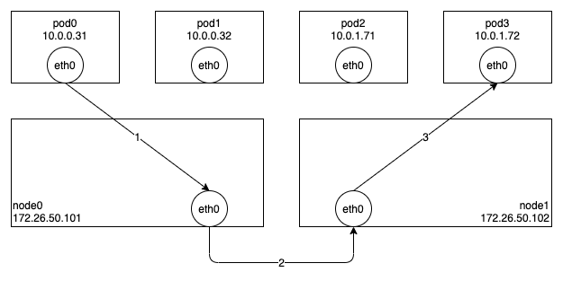

Cilium 은 IPVLAN 에 기반한 Datapath 기법을 제공하고 있다.
(아직 베타 버전 기능이라서 몇 가지 버그가 있지만, 기본적인 테스트는 가능한 수준이다.)
IPVLAN 은 VXLAN 과 마찬가지로 리눅스 커널이 제공하고 있는 기능이므로 IPVLAN 에 대한 자세한 설명은 생략하고, Cilium 의 동작 과정을 설명하면서 필요한 부분에 대해서만 간단히 부연설명하겠다.

아래 그림은 Cilium 에서 IPVLAN 을 사용할 경우 Pod-To-Pod 통신이 이루어지는 과정이다.
Node0 의 Pod0 에서 Node1 의 Pod3 으로 패킷을 보내는 과정을 살펴보도록 하자.



기본적으로 VXLAN 에 비해 구조가 단순한데, 그 이유는 Pod 안에 있는 eth0 이 IPVLAN 슬레이브로, Node 의 eth0 은 IPVLAN 마스터로 동작하기 때문이다.
IPVLAN 슬레이브에서 패킷을 전송하면 IP 헤더를 확인하여 동일한 노드에 해당 목적지 주소를 사용하는 IPVLAN 슬레이브가 있으면 바로 전달하고, 아니면 IPVLAN 마스터로 패킷을 전달한다.
VETH 를 통과해서 패킷을 캡슐화까지 해야하는 VXLAN 에 비해 성능적인 이점이 있기 때문에 안정화된 버전이 공개되면 널리 사용될 것으로 기대된다.

IPVLAN 은 MACLAN 과 달리 모든 슬레이브가 마스터의 맥 주소를 공유한다. 즉, MACLAN 처럼 마스터 네트워크 장치를 Promiscuous 모드로 사용하거나, 스위치의 물리적인 제한에 걸리는 문제가 없다는 말이다.
아래는 IPVLAN 기반의 Cilium 을 사용할 경우 Pod 과 노드의 네트워크 정보이다.

```
pod0 $ ip addr show
9: eth0@if2: <BROADCAST,MULTICAST,NOARP,UP,LOWER_UP> mtu 1500 qdisc noqueue state UNKNOWN group default qlen 1000
    link/ether a4:ae:11:18:c4:2d brd ff:ff:ff:ff:ff:ff link-netnsid 0
    inet 10.0.0.71/32 scope global eth0
       valid_lft forever preferred_lft forever
...
node0 $ ip addr show
2: eno1: <BROADCAST,MULTICAST,UP,LOWER_UP> mtu 1500 qdisc mq state UP group default qlen 1000
    link/ether a4:ae:11:18:c4:2d brd ff:ff:ff:ff:ff:ff
    altname enp2s0
    inet 172.26.50.170/24 brd 172.26.50.255 scope global eno1
       valid_lft forever preferred_lft forever
    inet6 fe80::a6ae:11ff:fe18:c42d/64 scope link
       valid_lft forever preferred_lft forever
```

그럼 이제 패킷이 전달되는 과정을 좀 더 상세히 살펴보도록 하자.
