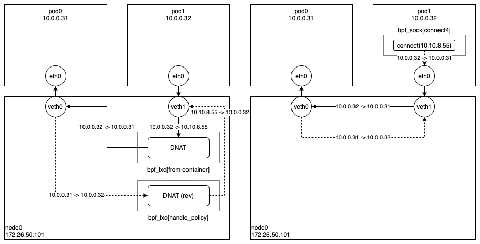

Cilium 에서 ClusterIP 서비스로 통신할때 로드밸런싱이 이루어지는 과정은 아래 그림과 같다. 왼쪽 그림은 네트워크 기반 로드밸런싱 방식이고, 오른쪽 그림은 소켓 기반 로드밸런싱 방식이다. 간단한 설명을 위해 백엔드가 같은 노드에 있는 경우만 살펴보자.

우선 왼쪽의 네트워크 기반 로드밸런싱을 살펴보면, Pod1 에서 생성된 패킷은 호스트 네임스페이스에 있는 veth1 의 ingress BPF 프로그램(cilium/bpf/bpf_lxc.c#from-container)에서 모두 처리되는데, 이때 목적지 주소가 서비스 주소(10.10.8.55)이면 해당 서비스의 백엔드 주소 중 하나(10.0.0.31)로 변환(DNAT)한 다음 패킷을 전달한다. 그리고 백엔드에서 응답 패킷이 오면 veth1 의 egress BPF 프로그램(cilium/bpf/bpf_lxc.c#handle_policy)에서 출발지 주소(10.0.0.31)를 원래의 서비스 주소(10.10.8.55)로 변환한 다음 Pod1 에게 응답 패킷을 전달하게 된다.

이 방식은 모든 패킷을 송수신할 때 DNAT 변환 및 역변환 과정을 거쳐야하기 때문에 오버헤드가 발생한다. 이를 해결하기 위해 나온 것이 바로 오른쪽의 소켓 기반 로드밸런싱이다.

소켓 기반 로드밸런싱은 그림에서 볼 수 있는 것처럼 굉장히 단순한데, Pod1 안에서 동작하는 앱이 connect() 시스템콜을 이용하여 소켓을 연결할 때 목적지 주소가 서비스 주소(10.10.8.55)이면 소켓의 목적지 주소를 바로 백엔드 주소(10.0.0.31)로 설정한다. 이후 앱에서 해당 소켓을 통해 보내는 모든 패킷의 목적지 주소는 이미 백엔드 주소(10.0.0.31)로 설정되어 있기 때문에 중간에 DNAT 변환 및 역변환 과정이 필요없어진다.

실제로 성능이 얼마나 개선되는지 알아보기 위해 간단한 실험을 하였다. 실험은 AB(Apache HTTP server Benchmarking tool)를 이용하였고, 결과는 아래와 같이 소켓 기반 로드밸런싱이 약 10% 정도 좋은 성능을 보여주고 있다.

| target                      | requests per second |
| :-------------------------- | ------------------: |
| network-based loadbalancing |                7263 |
| socket-based loadbalancing  |                8164 |

여기까지 Cilium 에서 제공하는 두 가지 로드밸런싱 기법에 대해 살펴보았다.
