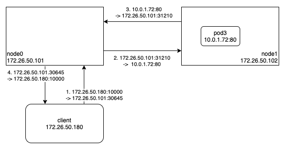

외부에서 쿠버네티스 서비스에 접근하는 대표적인 방법 중의 하나는 NodePort 서비스를 이용하는 것이다.
NodePort 서비스를 생성하면 30000~32767 사이의 임의의 값이 포트 번호로 할당되고, 선택된 Pod 이 어디에있든 상관없이 모든 노드에서 해당 포트 번호로 접근이 가능해진다.

설명을 위해 아래와 같이 리소스를 준비해두었다.

```
$ kubectl get pods -o wide
NAME    READY   STATUS    RESTARTS   AGE     IP           NODE     NOMINATED NODE   READINESS GATES
nginx   1/1     Running   0          6h15m   10.0.1.72    node1    <none>           <none>

$ kubectl get services
NAME         TYPE        CLUSTER-IP     EXTERNAL-IP   PORT(S)          AGE
nginx        NodePort    10.106.91.98   <none>        80:30645/TCP     6h49m

node0 $ cilium service list
ID   Frontend              Service Type   Backend
4    10.106.91.98:80       ClusterIP      1 => 10.0.1.72:80
5    172.26.50.101:30645   NodePort       1 => 10.0.1.72:80
```

웹서버 역할을 하는 Pod(nginx)은 Node1 에 위치하고, Node0 에서 Cilium 의 서비스 목록을 출력해보면, 위처럼 ClusterIP 프론트엔드와 NodePort 프론트엔드가 하나씩 보인다.
(Node1 에서 Cilium 의 서비스 목록을 출력해봐도 동일하게 30645 포트를 사용하는 NodePort 프론트엔드가 보일 것이다.)

그럼 이제 Client-To-NodePort 통신이 이루어지는 과정을 살펴보자.
클라이언트가 선택된 Pod 이 위치한 노드(Node1)로 바로 접속하는 경우는 간단하기 때문에, 선택된 Pod 이 위치한 노드와 다른 노드(Node0)로 접속하는 경우에 대해서 살펴보도록 하자.



기본 동작 방식은 SNAT 기법을 이용하는 것이다.
즉, 출발지 주소를 접속한 노드의 주소(172.26.50.101)로 변환한 후, 해당 패킷을 Node1 로 전달한다. 이때 출발지 주소(172.26.50.101)와 목적지 주소(10.0.1.72)를 매핑테이블에 저장해놓고, 출발지 주소(10.0.1.72)와 목적지 주소(172.26.50.101)인 패킷이 들어오면 앞에서 매핑테이블에 저장해놓은 정보를 이용해서 목적지 주소를 클라이언트 주소(172.26.50.180)로 변환한 다음, 해당 패킷을 클라이언트로 전달한다.
