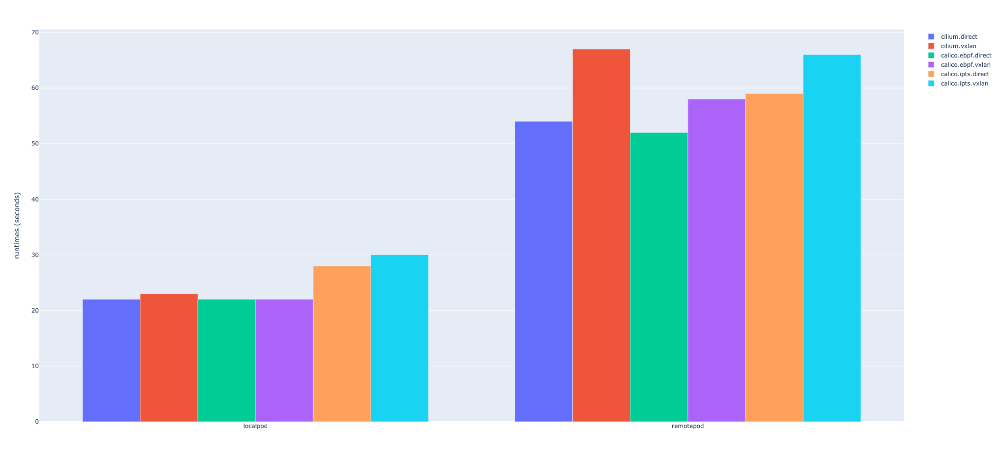

쿠버네티스의 CNI 에서 성능에 가장 큰 영향을 미치는 것은 다음 두 가지이다.

- eBPF vs IPTables (IPVS)
- Direct Routing vs Tunneling

Cilium 과 가장 대표적인 CNI 인 Calico 를 이용하여 어느 정도의 성능 차이가 나는지 살펴보자. Cilium 은 기본적으로 eBPF 를 사용하고 있고, Calico 는 최근에 eBPF 지원 기능을 추가하였다.

첫 번째 실험은 아파치 벤치마크(AB)를 이용하여 진행하였고, LocalPod 은 NGINX Pod 과 동일한 노드에서 벤치마크를 실행한 경우이고, RemotePod 은 다른 노드에서 벤치마크를 실행한 경우이다. (실험에 소요된 시간이므로 낮을수록 좋은 결과이다.)

LocalPod 은 같은 노드 안에서만 패킷을 전달하기 때문에 전체적으로 유사한 성능을 보이지만, IPTables 기반의 Calico 는 20~30% 정도 느린 성능을 보이고 있다. RemotePod 은 eBPF + Direct Routing 을 사용하는 경우가 가장 좋은 성능을 보이고 있다. Cilium 의 경우 VXLAN 기반 터널링보다 20% 정도 좋은 성능을 보이고 있고, Calico 는 IPTables + VXLAN 기반 터널링보다 22% 정도 좋은 성능을 보이고 있다. 그리고 IPTables 를 사용할 때는 룰의 개수가 많아질수록 더 나쁜 성능을 보이기 때문에 Cilium 을 사용하거나, Calico 를 사용하는 경우에도 eBPF 를 사용하는 것이 좋을 것이다. 또한, 모든 노드가 같은 서브넷에 일때는 Direct Routing 을 사용하는 것이 유리하고, Calico 는 같은 서브넷에 있는 노드끼리는 Direct Routing 을, 다른 서브넷에 있는 노드끼리는 터널링 기법을 자동으로 적용하는 CrossSubnet 기능을 제공하고 있다.

두 번째 실험은 Cilium 에서 DSR(Direct Server Return)을 적용하는 경우 어느 정도의 성능 차이가 나는지 살펴보자. 실험은 외부 클라이언트에서 NodePort 로 접근해서 HTTP 요청을 처리하는데 소요되는 시간의 P99 값을 측정하였다. (k6.js 를 이용하여 실험하였다.)

| datapath | target | DSR | http_req_duration (msecs) |
| :------- | :----- | :-- | ------------------------: |
| direct   | local  | X   |                     0.554 |
| direct   | remote | X   |                     0.818 |
| direct   | remote | O   |                     0.650 |
| vxlan    | local  | X   |                     0.542 |
| vxlan    | remote | X   |                     1.896 |
| vxlan    | remote | O   |                     1.263 |

NodePort 로 접근한 노드에 NGINX Pod 이 있는 경우(local)는 0.55 msecs 내외의 시간이 소요된다. NodePort 로 접근한 노드와 다른 노드에 NGINX Pod 이 있는 경우(remote)는 Direct Routing 은 0.818 msecs 가 소요되고, VXLAN 기반 터널링은 1.896 msecs 가 소요되지만, DSR 을 적용하는 경우 각각 25%(0.650 msecs)와 40%(1.264 msecs) 정도의 성능이 개선된다. 그리고 DSR 을 적용하면 응답 패킷을 다른 노드를 거치지 않고 외부 클라이언트로 바로 전송하기 때문에 클러스터 내부의 네트워크 트래픽을 줄이는 효과도 볼 수 있다.
