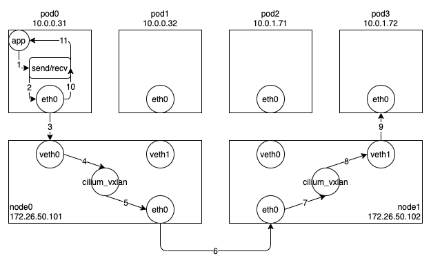

일반적으로 쿠버네티스 환경에서는 서비스(Service)를 통해 Pod 과 통신한다.
이는 특정 Pod 에 직접 접속하는 것보다 서비스의 셀렉터를 통해 선택된 여러 Pod 들 중 하나와 통신하는 것이 로드밸런싱이나 고가용성을 보장하는데 더 유리하기 때문이다.
쿠버네티스에서는 몇 가지 종류의 서비스를 정의하고 있는데, 클러스터 내부에서 접근할 때는 주로 ClusterIP 서비스를 이용하고, 외부에서 접근할 때는 NodePort 나 LoadBalancer 서비스를 이용한다.
쿠버네티스는 이러한 서비스의 역할을 정의만할 뿐이고, 실제로 이를 구현하는 것은 Cilium 과 같은 CNI 의 역할이다.
Cilium 에서 가장 기본적인 Pod-To-Service 통신이 이루어지는 과정에 대해 살펴보도록 하자.



설명을 위해 아래와 같이 리소스를 준비해두었다.

```
$ kubectl get pods -o wide
NAME    READY   STATUS    RESTARTS   AGE   IP           NODE     NOMINATED NODE   READINESS GATES
nginx   1/1     Running   0          20h   10.0.1.72    master   <none>           <none>
$ kubectl get services
NAME         TYPE        CLUSTER-IP    EXTERNAL-IP   PORT(S)        AGE
nginx        ClusterIP   10.98.36.83   <none>        80/TCP         20h
$ kubectl get endpoints
NAME         ENDPOINTS            AGE
nginx        10.0.1.72:80         20h
```

웹서버 역할을 하는 Pod(nginx)을 하나 준비해두고, run=nginx 라는 셀렉터를 가지는 서비스(nginx)를 생성하면 하나의 엔드포인트가 자동으로 생성된다.
(여기서는 run=nginx 라벨을 가지는 Pod(nginx)이 하나 밖에 없기 때문에 엔드포인트가 하나만 보이지만, Pod(nginx)이 두 개 이상이면 두 개 이상의 엔드포인트가 목록에 보일 것이다.)
그리고 Cilium 에서는 Pod 과 서비스 리소스를 지켜보면서(watch) 필요한 객체를 몇 가지 BPF 해시 맵(cilium_lxc, cilium_lb4_services_v2, ...)에 아래와 같이 추가한다.

```
$ cilium endpoint list
ENDPOINT   POLICY (ingress)   POLICY (egress)   IDENTITY   LABELS (source:key[=value])                       IPv6   IPv4         STATUS
           ENFORCEMENT        ENFORCEMENT
819        Disabled           Disabled          24963      k8s:io.cilium.k8s.policy.cluster=default                 10.0.1.72    ready
                                                           k8s:io.cilium.k8s.policy.serviceaccount=default
                                                           k8s:io.kubernetes.pod.namespace=default
                                                           k8s:run=nginx
$ cilium service list
ID   Frontend              Service Type   Backend
4    10.98.36.83:80        ClusterIP      1 => 10.0.1.72:80
```

여기까지 필요한 리소스는 준비되었고, 이를 통해 어떻게 Pod-To-Service 통신이 이루어지는지 살펴보자.

기본 동작 방식은 DNAT 기법을 이용하는 것이다.
즉, 목적지 주소가 서비스 주소(10.98.36.83:80)이면 이를 백엔드 주소(10.0.1.72:80)로 변환해서 전송하고, 출발지 주소(10.0.0.31:10000)와 목적지 주소(10.0.1.72:80)를 매핑테이블에 저장해놓는다.
그리고 출발지 주소(10.0.1.72:80)가 백엔드 주소이고 목적지 주소(10.0.0.31:10000)가 기존의 출발지 주소인 패킷이 들어오면 앞에서 매핑테이블에 저장해놓은 정보를 이용해서 출발지 주소를 서비스 주소로 역변환한다.
이렇게 하면 클라이언트 입장에서는 그냥 단순히 서비스 주소와 통신한 것처럼 생각하게 된다.
(기존의 iptables 에서 제공하는 DNAT, conntrack 과 기본적인 동작 방식은 같다.)

이제 서비스 주소를 백엔드 주소로 변환하는 역할을 수행하는 BPF 프로그램에 대해 살펴보자.

해당 역할은 LXC BPF 프로그램에서 수행할 수도 있지만, 현재 Cilium 에서는 SOCK BPF 프로그램(cilium/bpf/bpf_sock.c)을 루트 CGROUP 에 연결해서 해당 변환 과정을 처리한다.
(이렇게 SOCK BPF 프로그램을 이용하면 호스트에서도 쿠버네티스 서비스에 접근 가능해진다.)
쿠버네티스에서 Pod 을 생성하면 하위 CGROUP 을 생성하는데, 하위 CGROUP 은 기본적으로 상위 CGROUP 의 BPF 프로그램을 상속받기 때문에 Cilium 에서 데몬을 시작할때 필요한 BPF 프로그램을 루트 CGROUP 에 등록해놓으면 모든 Pod 은 해당 BPF 프로그램을 상속받게 된다.

실제 SOCK BPF 프로그램이 하는 역할을 살펴보면, connect() 와 sendto() 소켓 함수에 연결된 프로그램(connect4, sendmsg4)에서는 소켓의 목적지 주소(10.98.36.83)와 포트(80)를 백엔드 주소(10.0.1.72)와 포트(80)로 변환하고, cilium_lb4_reverse_sk 맵에 백엔드 주소와 포트를 등록해놓는다.
(위의 그림에서 1-2번에 해당한다.)
그리고 recvmsg() 소켓 함수에 연결된 프로그램(recvmsg4)에서는 cilium_lb4_reverse_sk 맵을 이용해서 목적지 주소(10.0.1.72)와 포트(80)를 다시 서비스 주소(10.98.36.83)와 포트(80)로 변환하게 된다.
(위의 그림에서 11-12번에 해당한다.)

나머지 과정(3-10번)은 VXLAN 혹은 IPVLAN 을 이용한 Pod-To-Pod 통신 과정과 동일하다.

참고로, 백엔드가 두 개 이상일 경우에는 어느 백엔드로 패킷을 전달할지를 결정해야 한다.
Cilium 에서는 기본적으로 랜덤하게 백엔드를 선택하지만, Consistent Hash 기반의 Maglev 도 지원할 계획이라고 한다.

여기까지 Cilium 에서 Pod-To-Service 통신이 이루어지는 과정을 살펴보았다.
