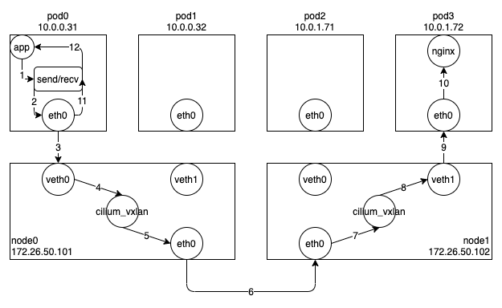

일반적으로 쿠버네티스 환경에서는 서비스(Service)를 통해 Pod 과 통신한다.
이는 특정 Pod 에 직접 접속하는 것보다 서비스의 셀렉터를 통해 선택된 여러 Pod 들 중 하나와 통신하는 것이 로드밸런싱이나 고가용성을 보장하는데 더 유리하기 때문이다.
쿠버네티스에서는 몇 가지 종류의 서비스를 정의하고 있는데, 클러스터 내부에서 접근할 때는 주로 ClusterIP 서비스를 이용하고, 외부에서 접근할 때는 NodePort 나 LoadBalancer 서비스를 이용한다.
쿠버네티스는 이러한 서비스의 역할을 정의만할 뿐이고, 실제로 이를 구현하는 것은 Cilium 과 같은 CNI 의 역할이다.
Cilium 에서는 이러한 서비스를 어떤 방식으로 구현했는지 살펴보도록 하겠다.

