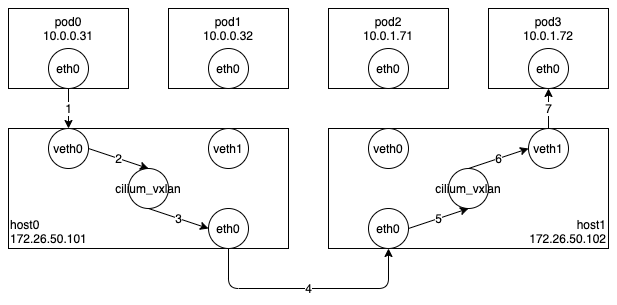

Cilium 의 대표적인(기본설정) Datapath 기법은 VXLAN 에 기반하고 있다.
리눅스 커널은 기본적으로 VXLAN 기능을 제공하고 있고, Cilium 은 이를 이용하고 있다.
VXLAN 에 대한 자세한 설명은 생략하고, Cilium 의 동작 과정을 설명하면서 필요한 부분에 대해서만 간단히 부연설명하겠다.

아래 그림은 Cilium 에서 VXLAN 을 사용할 경우 Pod-To-Pod 통신이 이루어지는 과정이다.
Node0 의 Pod0 에서 Node1 의 Pod3 으로 패킷을 보내는 과정을 살펴보도록 하자.
(Pod 이 서로 다른 노드에 존재하는 경우에 대해서만 설명하겠다.)

우선 그림에 나오는 다양한 네트워크 장치에 대해 설명하도록 하겠다.

첫 번째로, Cilium 에서는 새로운 Pod 을 생성할 때 VETH 를 하나씩 생성한다.
VETH 는 두 개의 가상 네트워크 장치를 생성하여 서로 연결해주는 기능을 제공한다.
위의 그림에서 보면 Pod0 안에 있는 eth0 와 Node0 에 있는 veth0 은 연결된 한쌍의 VETH 이고, 이 말은 eth0 으로 패킷을 전달하면 veth0 을 통해 패킷이 나가게 되고, 반대로 veth0 을 통해 패킷이 들어오면 eth0 으로 패킷을 수신할 수 있다는 의미이다.

두 번째로, Cilium 에서는 실제 VXLAN 통신을 담당할 가상 네트워크 장치를 생성한다.
이는 cilium_vxlan 이라는 이름을 사용하고, 노드별로 하나씩 생성된다.
veth0 에서 필요한 정보와 함께 L2 패킷을 cilium_vxlan 장치로 전달하면, cilium_vxlan 은 해당 L2 패킷에 VXLAN 헤더와 해당 패킷을 물리적인 네트워크 환경을 통해 전달하기 위해 필요한 L2/L3/UDP 헤더를 추가하여 물리 네트워크 장치(Node0 의 eth0)로 내보내게 된다.
(VXLAN 은 UDP 프로토콜을 이용하여 패킷을 전달한다.)
아래는 VXLAN 을 통해 외부로 나가는 실제 패킷의 구조이다.

| Ethernet | IP | UDP | VXLAN | Ethernet(in) | IP(in) | Payload |

위의 그림을 기준으로 실제 패킷에 들어가는 값을 정리해보면, 내부 IP 헤더의 출발지 주소는 10.0.0.31, 목적지 주소는 10.0.1.72 이고, 외부 IP 헤더의 출발지 주소는 172.26.50.101, 목적지 주소는 172.26.50.102 이다.
그리고 외부 UDP 헤더의 목적지 포트는 VXLAN 이 기본적으로 사용하는 8472 이다.

마지막으로, Node0 과 Node1 에 있는 eth0 는 물리 네트워크 장치를 의미한다.

그럼 이제 패킷이 전달되는 과정을 좀 더 상세히 살펴보도록 하자.

Node0 의 Pod0 에서 생성된 패킷은 eth0 을 통해 veth0 으로 전달된다.
veth0 의 ingress 에는 cilium/bpf/bpf_lxc.c 의 from-container 섹션이 붙어 있는데, 해당 프로그램의 역할은 목적지 주소가 동일한 노드이면 해당 목적지(Pod1) 의 veth1 로 패킷을 전달(redirect)하고, 아니면 목적지 노드의 주소와 함께 해당 패킷을 cilium_vxlan 으로 전달(redirect)한다.
cilium_vxlan 에서는 앞에서 설명한 것처럼 전달받은 패킷에 목적지 노드의 주소를 추가하여 물리 네트워크 장치(eth0) 로 패킷을 전달(redirect)한다.

Node1 의 물리 네트워크 장치(eth0) 로 수신된 UDP 패킷은 cilium_vxlan 에서 VXLAN 관련 간단한 처리를 한 다음 cilium_vxlan 의 ingress 에 붙어있는 cilium/bpf/bpf_overlay.c 의 from-overlay 섹션에서 처리된다.
여기서는 목적지 주소가 해당 노드에 있으므로 바로 해당 목적지(Pod3) 의 veth1 로 패킷을 전달(redirect)해서 veth1 의 egress 에 붙어있는 프로그램에서 처리해야 하지만, 성능을 높이기 위해 cilium_call_policy 맵에 목적지(Pod3) 의 엔드포인트 아이디를 인덱스로 사용해서 저장된 프로그램(cilium/bpf/bpf_lxc.c 의 handle_policy()) 을 tailcall 로 호출한다.
해당 프로그램에서는 필요한 처리를 한 뒤, 목적지(Pod3) 의 veth1 로 패킷을 전달(redirect)하고, 결국 해당 패킷은 Pod3 의 eth0 로 전달된다.

여기까지 VXLAN 을 통해 Pod-To-Pod 통신이 이루어지는 과정을 살펴보았다.
