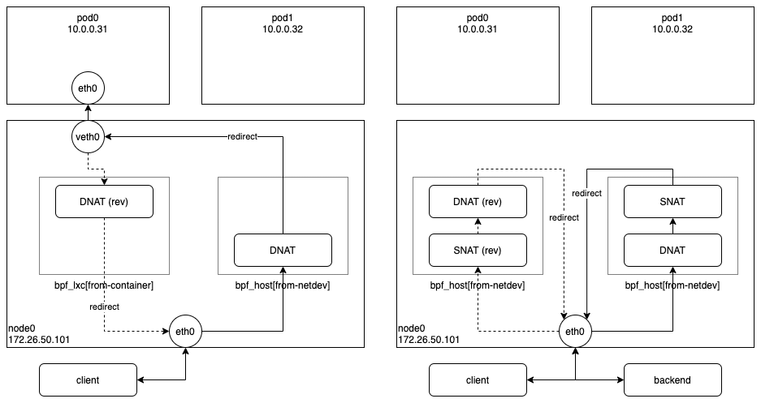
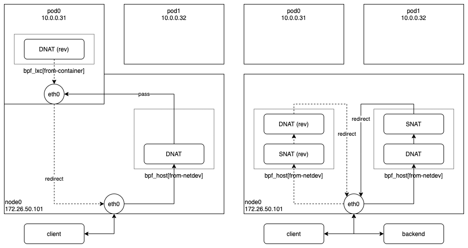

Cilium 에서 제공하는 IPVLAN 기반의 Routing Datapath 기법을 사용하던 중 NodePort 관련 버그를 발견하였다. (NodePort 는 모든 노드의 지정된 포트로 접속하면 백엔드(선택된 파드)로 연결해주는 서비스이다.) IPVLAN 을 사용하는 경우, 접속한 노드에 백엔드가 없는 경우는 잘 동작하지만 접속한 노드에 백엔드가 있는 경우는 동작하지 않는 문제가 발생했다. 왜 이런 문제가 발생하였는지 자세히 살펴보도록 하자.

아래 그림은 정상적으로 잘 동작하고 있는 VXLAN 기반의 Cilium 에서 NodePort 가 동작하는 과정을 보여주고 있다. 오른쪽은 다른 노드에 백엔드가 있는 경우이고, 왼쪽은 같은 노드에 백엔드가 있는 경우이다.

우선, 다른 노드에 백엔드가 있는 경우는, 클라이언트가 NodePort 로 접속하면 호스트 네트워크 디바이스에 연결된 ingress BPF 프로그램(cilium/bpf/bpf_host.c#from-netdev)에서 목적지 주소를 백엔드 주소로 변환(DNAT)하고 출발지 주소를 해당 노드의 주소로 변환(SNAT)한 다음, 백엔드가 있는 노드로 패킷을 전달한다. 그리고 응답 패킷을 받으면 호스트 네트워크 디바이스에 연결된 ingress BPF 프로그램에서 목적지 주소를 클라이언트의 주소로 변환하고 출발지 주소를 해당 노드의 주소로 변환한 다음, 클라이언트에게 패킷을 전달한다.

다음으로, 같은 노드에 백엔드가 있는 경우는, 클라이언트가 NodePort 로 접속하면 호스트 네트워크 디바이스에 연결된 ingress BPF 프로그램(cilium/bpf/bpf_host.c#from-netdev)에서 목적지 주소를 백엔드 주소로 변환(DNAT)한 다음, 바로 해당 백엔드 주소를 사용하는 Pod0 의 veth0 으로 패킷을 전달(redirect)한다. 그리고 Pod0 이 응답 패킷을 전달하면 Pod0 의 veth0 에 연결된 ingress BPF 프로그램(cilium/bpf/bpf_lxc.c#from-container)에서 출발지 주소를 해당 노드의 주소로 변환한 다음, 클라이언트에게 패킷을 전달한다.

이제 IPVLAN 기반의 Cilium 에서 NodePort 가 동작하는 과정을 살펴보자. 위와 마찬가지로 오른쪽은 다른 노드에 백엔드가 있는 경우이고, 왼쪽은 같은 노드에 백엔드가 있는 경우이다.

우선, 다른 노드에 백엔드가 있는 경우는 VXLAN 과 동일한 방식으로 잘 동작한다. 요청 패킷과 응답 패킷 모두 호스트 네트워크 디바이스에 연결된 ingress BPF 프로그램에서 처리하기 때문에 아무 문제없이 동작한다. 하지만 같은 노드에 백엔드가 있는 경우는 VXLAN 과 동일한 방식으로 동작하는 것처럼 보이지만 중요한 차이점이 있는데, 그건 바로 Pod0 의 응답 패킷을 Pod0 의 eth0 에 연결된 egress BPF 프로그램에서 처리한다는 것이다. 위의 그림을 자세히 보면 호스트의 ingress BPF 프로그램에서 Pod0 의 eth0 으로 패킷을 전달할 때 VXLAN 과 달리 redirect 를 사용하지 않고, 그냥 pass 를 하는 것이 보일 것이다. (redirect 는 리눅스 커널이 제공하는 bpf_redirect() 함수를 이용하여 원하는 네트워크 장치로 패킷을 바로 전달하는 것이고, pass 는 네트워크 스택을 거쳐 자연스럽게 패킷을 전달하는 것이다.) 이는 동일한 네트워크 네임스페이스에 존재하는 장치로만 redirect 를 사용할 수 있는데, 호스트 네트워크 디바이스와 Pod0 의 eth0 은 서로 다른 네트워크 네임스페이스에 있기 때문이다. 그래서 Pod0 의 eth0 에 연결된 egress BPF 프로그램에서도 호스트로 응답 패킷을 전달할 때 redirect 를 사용하지 않고 pass 를 해야하는데, 현재 Cilium 에서는 redirect 를 사용해서 이런 문제가 발생한 것이다.

여기까지 IPVLAN 기반의 Cilium 에서 NodePort 를 처리하는 과정에서 발생한 버그에 대해 자세히 살펴보았다.
