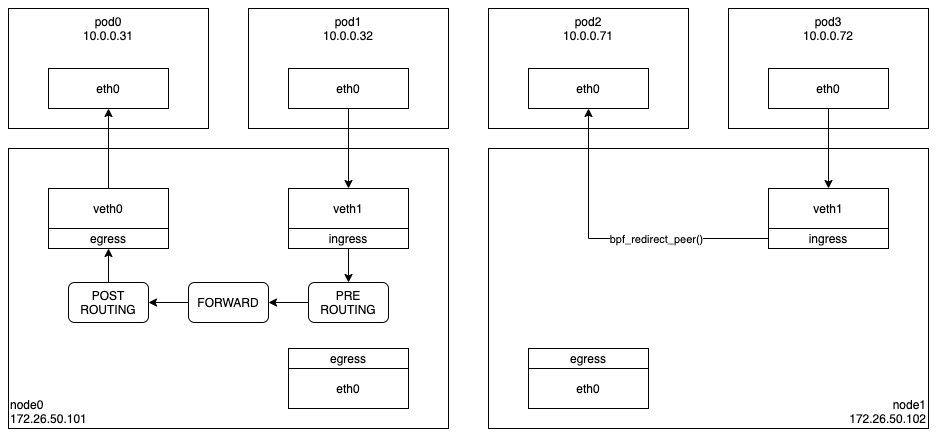
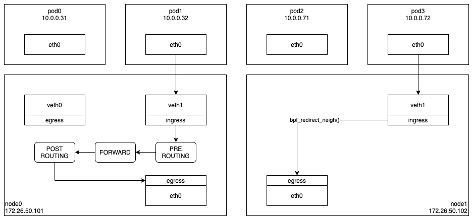

Cilium 에서 VETH 를 기반으로 Pod-To-Pod 통신이 이루어지는 과정은 아래 그림의 왼쪽과 같다. Pod1 의 eth0 으로 패킷을 전달하면 veth1 을 통해 호스트 네트워크 스택으로 패킷이 전달된다. 여기에서 목적지 주소를 이용하여 몇 단계의 처리를 거친 다음 veth0 을 통해 Pod0 의 eth0 으로 패킷이 전달되는데, Cilium 은 이러한 불필요한 과정을 줄이기 위해 bpf_redirect_peer() 라는 새로운 함수를 리눅스 커널에 추가하였다. 해당 함수를 이용하면 Pod-To-Pod 통신은 오른쪽 그림과 같이 훨씬 단순해진다.

bpf_redirect_peer() 함수의 역할은 단순하다. 이를 이용하여 특정 네트워크 장치로 패킷을 전달하면, 패킷이 해당 장치로 전달되는 것이 아니고 해당 장치의 연결장치(Peer)로 전달되는 것이다. (파드의 eth0 과 veth 는 한쌍의 VETH 이고, veth 의 연결장치는 파드의 eth0 이다.)

Pod3 의 eth0 과 연결된 veth1 의 ingress BPF 프로그램에서 bpf_redirect_peer() 함수를 이용하여 Pod2 로 패킷을 전달하면, 호스트 네트워크 스택과 veth0 을 거치지 않고 바로 Pod2 의 eth0 으로 패킷이 전달된다.

이와 유사하게 VETH 를 기반으로 Pod-To-Node 통신이 이루어지는 과정은 아래 그림의 왼쪽과 같다. Pod1 의 eth0 으로 패킷을 전달하면 veth1 과 호스트 네트워크 스택을 거쳐 호스트의 eth0 으로 패킷이 전달된다. Cilium 은 이러한 불필요한 과정을 줄이기 위해 bpf_redirect_neigh() 라는 새로운 함수를 리눅스 커널에 추가하였고, 앞의 경우처럼 이를 이용하면 Pod-To-Node 통신은 훨씬 단순해진다.

bpf_redirect_neigh() 함수의 역할 또한 단순하다. 이를 이용하면, 몇 단계에 걸친 네트워크 스택을 통과하지 않고, 바로 라우팅 테이블을 이용하여 다음 목적지(hop)를 정하고, 필요시 ARP 테이블을 갱신한 다음 해당 패킷을 장치로 전달한다.

여기까지 bpf_redirect_peer()/bpf_redirect_neigh() 함수를 이용하여 Pod-To-Pod/Pod-To-Node 통신이 이루어지는 과정을 살펴보았다.
