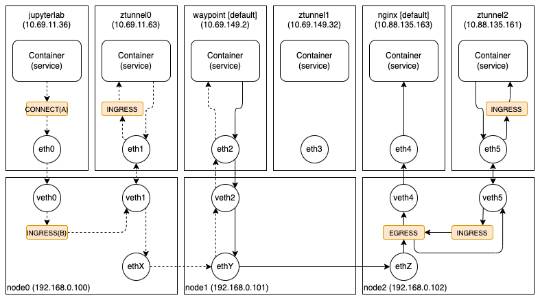

오늘은 Istio 에서 공개한 AmbientMesh 와 Cilium 을 함께 사용할 수 없는 문제에 대해 소개하고자 한다. Cilium 뿐 아니라 다양한 CNI 와 유사한 문제가 있는 것으로 알려져 있기 때문에, AmbientMesh 를 사용하길 원한다면 지금은 Calico(+IPTables)를 사용하는 것이 좋을 것이다.

CNI 로 Cilium 을 사용하는 경우, AmbientMesh 를 설치하면 정상적으로 동작하지 않는다. 크게 두 가지 이유가 있으니 하나씩 살펴보도록 하자.

첫 번째는 새로운 파드의 네트워크 환경을 구축해주는 CNI 플러그인 설정 파일 관련된 문제이다. 쿠버네티스 환경에서 새로운 파드가 추가되면 컨테이너 런타임(cri-o)은 등록된 CNI 플러그인(/etc/cni/net.d)을 이용하여 새로운 파드를 위한 네트워크 환경을 구축한다. 예를 들어, Cilium 을 사용하는 경우, 아래와 같은 CNI 플러그인 설정을 볼 수 있다.

```bash
$ cat /etc/cni/net.d/05-cilium.conflist
{
  "cniVersion": "0.3.1",
  "name": "cilium",
  "plugins": [
    {
      "enable-debug": true,
      "log-file": "/var/run/cilium/cilium-cni.log",
      "type": "cilium-cni"
    }
  ]
}
```

위의 CNI 플러그인 설정을 가진 환경에서 새로운 파드가 추가되면 컨테이너 런타임은 CNI 플러그인 실행 파일 디렉토리(/opt/cni/bin)에서 타입 이름(cilium-cni)과 동일한 이름을 가진 파일(/opt/cni/bin/cilium-cni)을 실행(CmdAdd)한다. 이런 방식으로 실행된 CNI 플러그인 실행 파일(cilium-cni)은 새롭게 추가된 파드를 위한 네트워크 장치를 만들고 eBPF 프로그램을 등록하는 등의 일을 수행한다.

AmbientMesh 도 기존의 CNI 와 유사한 방식으로 동작하는데, CNI 플러그인(istio-cni)을 등록하고, 새로운 파드가 추가되면 CNI 플러그인 실행 파일(/opt/cni/bin/istio-cni)이 실행되어 필요한 eBPF 프로그램을 등록하는 등의 일을 수행한다.

여기서 문제는 AmbientMesh 가 CNI 플러그인 설정 파일 디렉토리(/etc/cni/net.d)를 모니터링하면서 파일이 변경될 때마다 자신이 필요한 설정을 추가하는데, Cilium 도 CNI 플러그인 설정 파일 디렉토리를 모니터링하면서 파일이 변경될 때마다 불필요한 설정을 제거한다는 것이다.

그래서 CNI 플러그인 설정 파일을 담당하는 파드(cilium, istio-cni-node)의 로그를 살펴보면, 아래처럼 반복적으로 설정 파일을 서로 수정하는 것을 볼 수 있다.

```bash
$ kubectl logs cilium-62984 -n kube-system
...
level=info msg="Activity in /host/etc/cni/net.d/, re-generating CNI configuration" subsys=cni-config
level=info msg="Activity in /host/etc/cni/net.d/, re-generating CNI configuration" subsys=cni-config
level=info msg="Generating CNI configuration file with mode none" subsys=cni-config
level=info msg="Activity in /host/etc/cni/net.d/, re-generating CNI configuration" subsys=cni-config
level=info msg="Activity in /host/etc/cni/net.d/, re-generating CNI configuration" subsys=cni-config
...

$ kubectl logs istio-cni-node-smkbc -n istio-system
...
2023-05-11T08:58:12.311527Z	info	install	CNI config: {
  "cniVersion": "0.3.1",
  "name": "istio-cni",
  "type": "istio-cni",
  "log_level": "info",
  "log_uds_address": "/var/run/istio-cni/log.sock",
  "ambient_enabled": true,
  "kubernetes": {
      "kubeconfig": "/etc/cni/net.d/ZZZ-istio-cni-kubeconfig",
      "cni_bin_dir": "/opt/cni/bin",
      "exclude_namespaces": [ "kube-system" ]
  }
}
2023-05-11T08:58:12.311944Z	info	install	CNI config file /host/etc/cni/net.d/05-cilium.conflist exists. Proceeding.
2023-05-11T08:58:12.312576Z	info	install	Created CNI config /host/etc/cni/net.d/05-cilium.conflist
2023-05-11T08:58:12.312586Z	info	install	CNI configuration and binaries reinstalled.
2023-05-11T08:58:12.312965Z	info	install	Detect changes to the CNI configuration and binaries, attempt reinstalling...
...
```

AmbientMesh 가 원하는 CNI 플러그인 설정은 아래와 같지만, Cilium 에서 설정 파일을 지속적으로 변경하고 있는 것이다. 이 문제는 다양한 방법으로 해결할 수 있겠지만, 개인적인 생각으로는 CNI 플러그인 목록을 하나의 파일에서 관리하지 않고, 여러 파일로 분리해서 각자 관리하는 것이 깔끔해 보인다.

```bash
$ cat /etc/cni/net.d/05-cilium.conflist
{
  "cniVersion": "0.3.1",
  "name": "cilium",
  "plugins": [
    {
      "enable-debug": true,
      "log-file": "/var/run/cilium/cilium-cni.log",
      "type": "cilium-cni"
    },
    {
      "ambient_enabled": true,
      "kubernetes": {
        "cni_bin_dir": "/opt/cni/bin",
        "exclude_namespaces": [
          "kube-system"
        ],
        "kubeconfig": "/etc/cni/net.d/ZZZ-istio-cni-kubeconfig"
      },
      "log_level": "info",
      "log_uds_address": "/var/run/istio-cni/log.sock",
      "name": "istio-cni",
      "type": "istio-cni"
    }
  ]
}
```

두 번째는 서비스 주소를 파드 주소로 변환해주는 로드밸런싱과 관련된 문제이다. Cilium 에서는 일반적으로 파드의 호스트 네트워크 장치(veth0)의 ingress BPF 프로그램(B)에서 로드밸런싱을 수행하고, 소켓 기반 로드밸런싱을 사용하는 경우에는 파드가 Connect 시스템콜을 호출(A)할 때 서비스 주소를 파드 주소로 미리 변환한다. 이렇게 되면 Ztunnel 과 프록시(Waypoint)가 전달받는 패킷의 목적지 주소는 서비스 주소가 아닌 파드 주소이기 때문에, 대부분의 정책이 서비스 주소를 기반으로 동작하는 Istio 는 올바르게 정책을 수행할 수 없게 된다. 그래서 AmbientMesh 를 사용하는 경우, Cilium 에서 로드밸런싱을 막거나 별도의 방법으로 원래의 목적지(서비스) 주소를 알아낼 수 있는 방법이 필요할 것으로 보인다.



지금까지 AmbientMesh 와 Cilium 을 함께 사용할 수 없는 문제에 대해 분석하였다. 두 가지 문제 모두 해결이 어렵진 않지만, 고려해야할 사항들이 많기 때문에 많은 논의가 필요해보인다.
