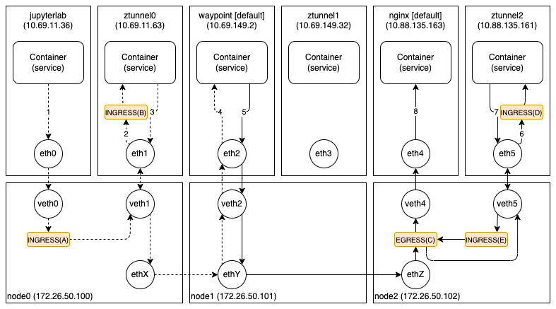

jupyterlab

```
4e:c8:60:12:7b:5b > ee:ee:ee:ee:ee:ee,
10.69.11.36.60348 > 172.16.52.69.80: ...
```

ztunnel

```
4e:c8:60:12:7b:5b > 3e:53:50:ac:00:d4,
10.69.11.36.60348 > 172.16.52.69.80: ...
```

```
3e:53:50:ac:00:d4 > ee:ee:ee:ee:ee:ee,
10.69.11.36.60157 > 10.69.149.2.15008: ...
```

waypoint

```
ee:ee:ee:ee:ee:ee > 0a:20:6d:71:01:f7,
10.69.11.36.60157 > 10.69.149.2.15008: ...
```

```
0a:20:6d:71:01:f7 > ee:ee:ee:ee:ee:ee,
10.69.149.2.59990 > 10.88.135.163.15008: ...
```

ztunnel

```
ee:ee:ee:ee:ee:ee > ce:7f:ba:06:21:08,
10.69.149.2.59990 > 10.88.135.163.15008: ...
```

```
ce:7f:ba:06:21:08 > ee:ee:ee:ee:ee:ee,
10.69.149.2.34621 > 10.88.135.163.80: ...
```

nginx

```
ce:7f:ba:06:21:08 > ba:02:f4:c8:98:77,
10.69.149.2.34621 > 10.88.135.163.80: ...
```
