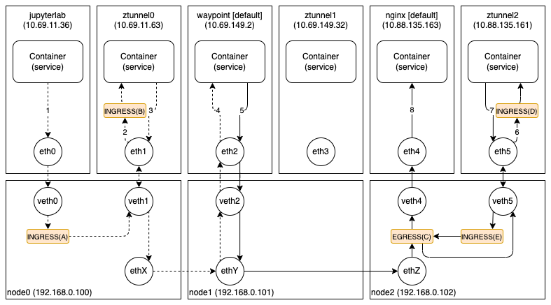

오늘은 Istio 에서 공개한 AmbientMesh 의 동작 과정을 분석해보도록 하겠다. 성능이나 확장성 면에서 우수한 eBPF 모드를 기준으로 설명할 계획이며, CNI 는 Calico(+IPTables)를 사용하였다.

아래 그림은 출발지 파드(jupyterlab)에서 목적지 파드(nginx)로 패킷이 전달되는 과정을 보여주고 있다. (출발지 파드에서는 목적지 서비스(nginx)의 주소(172.16.52.69)로 접속하였다.) 목적지 파드는 프록시(Waypoint)가 설치된 네임스페이스(default)에 속해있기 때문에 패킷은 해당 프록시를 통해서 전달된다. 설명은 패킷이 전달되는 순서대로(그림에 표시된 1~8번까지의 숫자) 진행하도록 하겠다.



1번은 출발지 파드에서 패킷이 송신되는 단계이다. 패킷의 출발지 물리주소(4e:c8:60:12:7b:5b)는 출발지 파드(juypterlab)의 네트워크 장치(eth0)의 주소이고, 목적지 물리주소(ee:ee:ee:ee:ee:ee)는 출발지 파드의 호스트 네트워크 장치(veth0)의 주소이다. 그리고 패킷의 출발지/목적지 주소는 각각 출발지 파드(10.69.11.36)와 목적지 서비스(172.16.52.69)의 주소이다.

```
# packet header in 1 step
4e:c8:60:12:7b:5b > ee:ee:ee:ee:ee:ee,
10.69.11.36.60348 > 172.16.52.69.80: ...
```

출발지 파드의 네트워크 장치(eth0)를 통해 송신된 패킷은 VETH 로 연결된 호스트 네트워크 장치(veth0)로 전달되고, 호스트 네트워크 장치(veth0)의 ingress BPF 프로그램(A)에서는 패킷의 목적지 물리주소를 터널링 파드(ztunnel0)의 네트워크 장치(eth1)의 물리주소(3e:53:50:ac:00:d4)로 수정한 다음, 강제로 터널링 파드의 호스트 네트워크 장치(veth1)로 전달한다. 그리고 호스트 네트워크 장치(veth1)로 전달된 패킷은 VETH 로 연결된 네트워크 장치(eth1)로 전달된다.

2번은 터널링 파드에서 패킷이 수신되는 단계이다. 수신된 패킷은 네트워크 장치(eth1)의 ingress BPF 프로그램(B)에서 강제로 Ztunnel 이 아웃바운드 포트(15001)로 대기(listen)하고 있는 소켓으로 전달된다. 이 때 생성(accept)되는 소켓의 로컬 주소는 전달받은 패킷의 목적지 주소인 목적지 서비스(172.16.52.69:80)의 주소이고, conntrack 맵에도 목적지 주소는 목적지 서비스(172.16.52.69:80)의 주소로 등록되어 있다.

```
# packet header in 2 step
4e:c8:60:12:7b:5b > 3e:53:50:ac:00:d4,
10.69.11.36.60348 > 172.16.52.69.80: ...
```

3번은 터널링 파드에서 패킷이 송신되는 단계이다. 목적지 서비스가 속해있는 네임스페이스가 프록시(Waypoint)를 사용하기 때문에 전달받은 패킷은 프록시(10.69.149.2)로 전달된다. 이때 패킷의 출발지 주소는 터널링 파드의 주소가 아니 전달받은 패킷의 출발지 주소인 출발지 파드의 주소(10.69.11.36)를 사용한다. 그렇다면 프록시가 보내는 패킷의 목적지 주소도 출발지 파드의 주소이겠지만, 출발지 파드가 받는 모든 패킷은 터널링 파드가 가로채기 때문에 문제없이 동작한다. 그리고 원래의 목적지 주소(172.16.52.69:80)는 HTTP/2 Connect 기반의 HBONE 프로토콜을 이용하여 Ztunnel 과 프록시가 연결되기 때문에 URI 로 전달한다.

```
# packet header in 3 step
3e:53:50:ac:00:d4 > ee:ee:ee:ee:ee:ee,
10.69.11.36.60157 > 10.69.149.2.15008: ...
```

4번은 프록시 파드에서 패킷이 수신되는 단계이다. 프록시는 패킷의 출발지 주소(10.69.11.36)와 URI 로 전달받은 원래의 목적지 주소(172.16.52.69:80)를 이용하여 필요한 정책을 수행한 다음 목적지 파드(nginx)를 결정한다.

```
# packet header in 4 step
ee:ee:ee:ee:ee:ee > 0a:20:6d:71:01:f7,
10.69.11.36.60157 > 10.69.149.2.15008: ...
```

5번은 프록시 파드에서 패킷이 송신되는 단계이다. 전달받은 패킷을 목적지 파드(nginx)의 주소(10.88.135.163)로 전달하지만, 목적지 파드의 노드(node2)에 있는 터널링 파드가 패킷을 가로채기 때문에 패킷의 목적지 포트는 Ztunnel 의 인바운드 포트(15008)를 사용한다. 그리고 3번과 마찬가지로 Ztunnel 과 프록시(Waypoint)는 HBONE 프로토콜로 연결되기 때문에 원래의 목적지 주소(10.88.135.163:80)는 URI 로 전달된다.

```
# packet header in 5 step
0a:20:6d:71:01:f7 > ee:ee:ee:ee:ee:ee,
10.69.149.2.59990 > 10.88.135.163.15008: ...
```

목적지 파드의 호스트 네트워크 장치(veth4)로 수신된 패킷은 egress BPF 프로그램(C)에서 패킷의 목적지 물리주소를 터널링 파드(ztunnel2)의 네트워크 장치(eth5)의 물리주소(ce:7f:ba:06:21:08)로 수정한 다음, 강제로 터널링 파드의 호스트 네트워크 장치(veth5)로 전달한다. 그리고 호스트 네트워크 장치(veth5)로 전달된 패킷은 VETH 로 연결된 네트워크 장치(eth5)로 전달된다.

6번은 터널링 파드에서 패킷이 수신되는 단계이다. 수신된 패킷은 네트워크 장치(eth5)의 ingress BPF 프로그램(D)에서 강제로 Ztunnel 이 인바운드 포트(15008)로 대기(listen)하고 있는 소켓으로 전달된다.

```
# packet header in 6 step
ee:ee:ee:ee:ee:ee > ce:7f:ba:06:21:08,
10.69.149.2.59990 > 10.88.135.163.15008: ...
```

7번은 터널링 파드에서 패킷이 송신되는 단계이다. 프록시에서 URI 로 전달받은 원래의 목적지 주소(10.88.135.163:80)로 패킷을 전달한다. 3번과 마찬가지로, 패킷의 출발지 주소는 터널링 파드의 주소가 아닌 전달받은 패킷의 출발지 주소(10.69.149.2)를 그대로 사용한다.

```
# packet header in 7 step
ce:7f:ba:06:21:08 > ee:ee:ee:ee:ee:ee,
10.69.149.2.34621 > 10.88.135.163.80: ...
```

터널링 파드의 호스트 네트워크 장치(veth5)로 수신된 패킷은 ingress BPF 프로그램(E)에서 패킷의 목적지 물리주소를 목적지 파드(nginx)의 네트워크 장치(eth4)의 물리주소(ba:02:f4:c8:98:77)로 수정한 다음, 강제로 목적지 파드의 호스트 네트워크 장치(veth4)로 전달한다. 여기서 중요한 점은 호스트 네트워크 장치(veth4)로 수신된 패킷이 다시 터널링 파드로 전달되는 것을 막기 위해 패킷에 정해진 표시(BYPASS)를 해야한다는 것이다. 그래서 목적지 파드의 호스트 네트워크 장치(veth4)로 수신된 패킷은 터널링 파드로 전달되지 않고 VETH 로 연결된 네트워크 장치(eth4)로 전달된다.

8번은 목적지 파드에서 패킷이 수신되는 단계이다. 아직은 프록시(Waypoint)가 투명하게 동작하지 않기 때문에 원래의 출발지 주소가 아닌 프록시의 주소로 전달된다.

```
# packet header in 8 step
ce:7f:ba:06:21:08 > ba:02:f4:c8:98:77,
10.69.149.2.34621 > 10.88.135.163.80: ...
```
