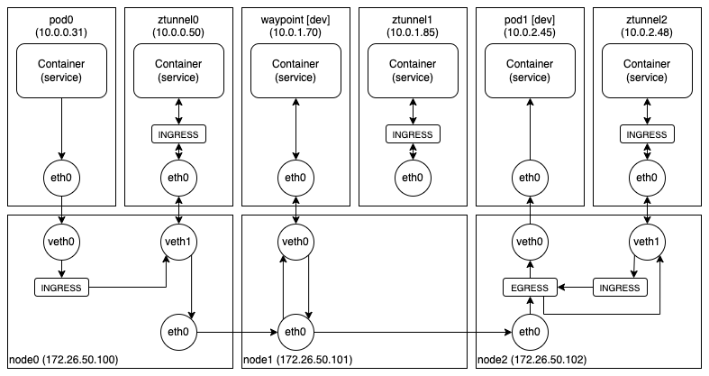

Istio 는 가장 유명한 서비스 메시(Service Mesh) 솔루션이고, 쿠버네티스를 사용하는 대부분의 회사들이 Istio 를 사용하고 있다. 하지만, 예전부터 Istio 가 사용하던 프록시(Envoy) 기반의 사이드카(Sidecar) 방식은 다양한 문제와 한계를 드러내고 있다. 오늘은 이를 해결하기 위해 최근 공개된 AmbientMesh 에 대해 소개하고자 한다. (해당 기능은 아직 한창 개발 중이기 때문에 제품에 적용할 수 있는 단계는 아니다.)

우선, Istio 가 AmbientMesh 를 이용하여 해결하고자 하는 문제부터 간단히 살펴보자.

첫 번째는, 굉장히 다양한 기능을 제공하는 프록시를 모든 파드에 사이드카 형태로 삽입하는 방식으로 동작하기 때문에 정확한 자원 사용량을 예측하기 힘들고 필요 이상으로 자원 사용량이 증가한다는 것이다.

두 번째는, 트래픽 관련 정책은 출발지(Source) 파드에 있는 프록시에서 처리하고 대부분의 보안 관련 정책은 목적지(Destination) 파드에 있는 프록시에서 처리한다는 것이다. 이로 인해 발생하는 구체적인 문제는 다음과 같다.

- 확장성 - 모든 파드의 프록시가 모든 파드에 대한 정책을 알고 있어야 하기 때문에, 특정 파드에 대한 정책이 변경되면 모든 파드의 프록시가 갱신되어야 한다.
- 보안성 - 모든 파드의 프록시가 모든 파드에 대한 정책을 알고 있기 때문에 보안적으로 안전하다고 볼 수 없다.
- 디버깅 - 어떤 정책은 출발지 파드의 프록시에서 처리하고, 어떤 정책은 목적지 파드의 프록시에서 처리하기 때문에 문제가 발생했을 때 파악하기 쉽지 않다.

이러한 문제를 해결하기 위해 Istio 가 개발 중인 AmbientMesh 는 모든 파드에 프록시를 삽입하는 방식이 아닌, 네임스페이스(Namespace) 혹은 서비스 어카운트(ServiceAccount) 별로 하나의 프록시(Waypoint)를 설치하는 방식을 사용한다. 그리고 안전한 오버레이(Overlay) 네트워크를 제공하는 Ztunnel 을 노드 별로 하나씩 설치해서 L4 수준의 정책은 Ztunnel 에서 처리하고 L7 수준의 정책만 프록시에서 처리하는 방식도 지원한다.

AmbientMesh 의 세부적인 동작 과정을 소개하기 전에 간단히 기존의 사이드카 방식(IPTables 기반)이 어떻게 동작하는지 살펴보자. 아래 그림은 서비스 메시를 사용 중인 두 개의 파드가 통신하는 과정을 보여주고 있다.

앞에서 설명했던 것처럼 서비스 메시를 사용 중인 모든 파드에는 프록시(Envoy)가 삽입되어 있고, 모든 송수신 패킷은 넷필터(IPTables)에 의해 프록시로 전달되어 처리된다. 예를 들어, 카나리(Canary) 배포를 한다면 출발지 파드(Pod0)의 프록시에서 목적지 파드가 선택되고, 접근 제어 정책을 사용한다면 목적지 파드(Pod1)의 프록시에서 해당 정책이 수행된다.

이제, AmbientMesh (+eBPF) 가 어떻게 동작하는지 간단히 살펴보자. 아직 Cilium 은 지원하지 않고, AmbientMesh 에서 eBPF 를 사용하는 경우 CNI 에서는 eBPF 를 사용할 수 없기 때문에 Calico (+IPTables) 를 CNI 로 사용하였다.

위의 그림은 0번 파드에서 Ztunnel 과 프록시(Waypoint)를 거쳐서 1번 파드로 패킷이 전달되는 과정을 보여주고 있다. 0번 파드에서 송신된 패킷은 호스트(Ingress)에서 같은 노드에 있는 Ztunnel 로 전달되고, 목적지 파드가 속해있는 네임스페이스(dev)에 프록시(Waypoint)가 있는 경우에는 프록시로 패킷을 전달(HBONE)한다. (HBONE 은 HTTP/2 Connect 프로토콜을 이용하여 터널링을 구현한 프로토콜이다.) 프록시는 필요한 처리를 해서 목적지 파드의 주소가 정해지면 다시 패킷을 전달하고, 1번 파드로 전달된 패킷은 호스트(EGRESS)에서 같은 노드에 있는 Ztunnel 로 전달된다.
