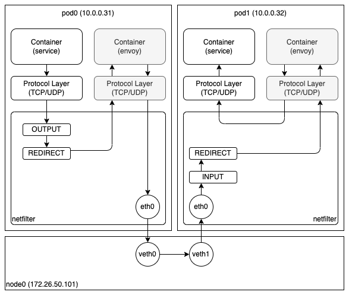

Istio 는 가장 유명한 서비스 메시(Service Mesh) 솔루션이고, 쿠버네티스를 사용하는 대부분의 회사들이 Istio 를 사용하고 있다. 하지만, 예전부터 Istio 가 사용하던 프록시(Envoy) 기반의 사이드카(Sidecar) 방식은 다양한 문제와 한계를 드러내고 있다. 오늘은 이러한 문제를 해결하기 위해 최근 공개된 AmbientMesh 에 대해 소개하고자 한다. (해당 기능은 아직 한창 개발 중이기 때문에 제품에 적용할 수 있는 단계는 아니다.)

우선, Istio 가 AmbientMesh 를 이용하여 해결하고자 하는 문제부터 간단히 살펴보자.

첫 번째는, 굉장히 다양한 기능을 제공하는 프록시를 모든 파드에 사이드카 형태로 삽입하는 방식으로 동작하기 때문에 정확한 자원 사용량을 예측하기 힘들고 필요 이상으로 자원 사용량이 증가한다는 것이다.

두 번째는, 트래픽 관련 정책은 출발지 파드에 있는 프록시에서 처리하고 대부분의 보안 관련 정책은 목적지 파드에 있는 프록시에서 처리한다는 것이다. 이로 인해 발생하는 구체적인 문제는 다음과 같다.

- 확장성 - 모든 파드의 프록시가 모든 파드에 대한 정책을 알고 있어야 하기 때문에, 특정 파드에 대한 정책이 변경되면 모든 파드의 프록시가 갱신되어야 한다.
- 보안성 - 모든 파드의 프록시가 모든 파드에 대한 정책을 알고 있기 때문에 보안적으로 안전하다고 볼 수 없다.
- 디버깅 - 어떤 정책은 출발지 파드의 프록시에서 처리하고, 어떤 정책은 목적지 파드의 프록시에서 처리하기 때문에 문제가 발생했을 때 파악하기 쉽지 않다.

