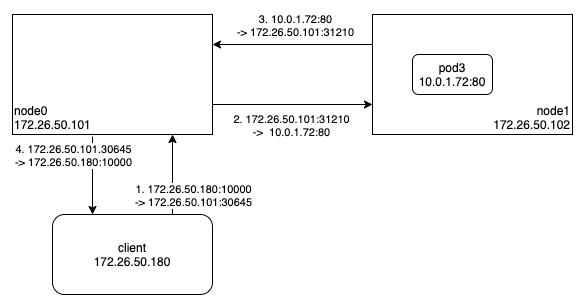

쿠버네티스(K8S)를 지원하는 대표적인 오픈소스 로드밸런서(LoadBalancer)인 [MetalLB](https://metallb.universe.tf/) 를 이용하여 카프카(Kafka)의 네트워크 성능을 개선한 사례를 공유하고자 한다. 우리는 [StrimziOperator](https://strimzi.io/) 를 이용하여 카프카를 배포/운영하고 있으며, 초기에는 간단히 노드포트(NodePort)를 이용하여 부트스트랩(Bootstrap)과 브로커(Broker)에 접속했기 때문에 불필요한 네트워크 홉(Hop)이 추가되는 문제가 발생하였다. 우선, 간단히 노드포트가 어떻게 동작하기에 이런 문제가 생긴 것인지 알아보도록 하자.



위의 그림은 클라이언트가 노드포트를 이용하여 서비스에 접근하는 과정이다. 클라이언트는 해당 서비스의 엔드포인트(Pod3)가 어느 노드에 있는지 알 수 없기 때문에 임의의 노드(위에서는 Node0)로 접속한다. 위의 경우에는 엔드포인트가 Node1 에 있었기 때문에, Node0 에서 SNAT(SourceNetworkAddressTranslation) 를 이용하여 Node1 로 요청 메세지를 송신하고 응답 메세지를 수신한 다음 클라이언트에게 전달한다. (부트스트랩이 전달해준 브로커의 주소도 노드포트 주소였기 때문에 실제 브로커 파드가 위치한 노드의 주소가 아닐 수 있다.) 이는 클라이언트가 처음부터 엔드포인트가 있는 노드(Node1)로 바로 접속했으면 발생하지 않았을 문제이고, 이 문제를 해결하기 위해 쿠버네티스가 제공하는 기능이 로드밸런서이다.

지금부터 MetalLB 를 이용하여 어떻게 이 문제를 해결하였는지 소개하겠다. MetalLB 는 L2 모드와 BGP 모드를 지원하기 때문에 각각 어떻게 동작하는지, 어떤 장단점이 있는지도 같이 살펴보도록 하자.

다음은 검증에 사용된 노드의 주소(IP/MAC)이다.

- Node0 : 192.168.200.200 (f4:6b:8c:82:42:33)
- Node1 : 192.168.200.201 (f4:6b:8c:82:42:2b)
- Node2 : 192.168.200.202 (f4:6b:8c:82:41:f8)

아래는 부트스트랩과 브로커의 서비스 목록이다. 모두 로드밸런서로 설정되어 있기 때문에 할당된 외부 주소(ExternalIP)를 확인할 수 있다. (해당 리스너의 Advertised 주소는 아래 외부 주소로 설정되어있다.)

```bash
$ kubectl get services -n kafka
NAME              TYPE           CLUSTER-IP       EXTERNAL-IP       PORT(S)
kafka-0           LoadBalancer   172.16.13.97     192.168.200.241   9096:30793/TCP
kafka-1           LoadBalancer   172.16.102.197   192.168.200.242   9096:30956/TCP
kafka-2           LoadBalancer   172.16.72.116    192.168.200.243   9096:30991/TCP
kafka-bootstrap   LoadBalancer   172.16.56.188    192.168.200.240   9096:31023/TCP
```

그리고 브로커의 파드 목록이다. 각각 어느 노드에 있는지 확인할 수 있다.

```bash
$ kubectl get pods -n kafka -o wide
NAME              READY   STATUS    IP           NODE
kafka-0           1/1     Running   10.0.2.233   node1
kafka-1           1/1     Running   10.0.0.74    node2
kafka-2           1/1     Running   10.0.1.189   node0
...
```

## MetalLB L2 모드 기반 로드밸런싱

L2 모드는 MetalLB 가 데몬셋으로 설치하는 스피커(Speaker)가 외부 주소(IP)에 대한 ARP 요청에 응답하는 방식이다. 간단하게 사용할 수 있지만, 서비스의 엔드포인트가 2 개 이상의 노드에 있는 경우에는 하나의 노드만 요청을 받을 수 있는 문제가 있다. 예를 들어, Node0 과 Node1 에 엔드포인트가 동시에 존재하는 경우, MetalLB 는 임의로 리더를 선출하고, 리더로 선출된 노드의 스피커가 ARP 요청에 응답한다. 결국 해당 외부 주소로는 리더로 선출된 노드에만 접근할 수 있게 된다.

아래는 0번 브로커에 있는 토픽/파티션에 접근하는 클라이언트의 접속 정보이다. 부트스트랩으로부터 필요한 메타데이터를 가져와서 0번 브로커의 외부 주소(192.168.200.241)로 접속하는걸 볼 수 있다.

```bash
INFO:kafka.conn:<BrokerConnection node_id=0 host=192.168.200.241:9096 <connecting> [IPv4 ('192.168.200.241', 9096)]>: connecting to 192.168.200.241:9096 [('192.168.200.241', 9096) IPv4]
```

그렇다면 실제로 어떤 노드로 접속했을까? 아래는 클라이언트의 ARP 캐시 목록이다.

```bash
$ arp -a
? (192.168.200.241) at f4:6b:8c:82:42:33 [ether] on enp1s0
...
```

그런데 위의 물리 주소(MAC)는 0번 브로커가 있는 Node1 의 물리 주소(f4:6b:8c:82:42:2b)가 아니고, Node0 의 물리 주소(f4:6b:8c:82:42:33)이다. 왜 이런 일이 발생했을까? 이유는 외부 트래픽 정책(ExternalTrafficPolicy)이 클러스터(Cluster)로 되어있기 때문이다. 해당 정책은 외부에서 접속했을 때 다른 노드에 있는 파드에 대한 접근을 허용하기 때문에 MetalLB 는 임의의 노드를 리더로 선출한다. 그래서 외부 트래픽 정책을 다른 노드에 있는 파드에 대한 접근을 허용하지 않는 로컬(Local)로 설정하면 아래와 같이 0번 브로커가 있는 Node1 로만 접속하게 된다.

```bash
$ arp -a
? (192.168.200.241) at f4:6b:8c:82:42:2b [ether] on enp1s0
...
```

이제 Node1 로 들어온 요청 메세지를 어떻게 0번 브로커 파드로 전달하는지 살펴보자. 아래는 Node1 의 서비스 목록(Cilium)이다. 외부 주소로 들어온 요청을 0번 브로커 주소(10.0.2.233)로 전달하는 것을 확인할 수 있다. (eBPF 프로그램(Cilium)에서 DNAT(DestinationNetworkAddressTranslation) 를 이용하여 메세지를 전달한다.)

```bash
node1 $ cilium service list
ID     Frontend                  Service Type   Backend
2174   192.168.200.241:9096      LoadBalancer   1 => 10.0.2.233:9096 (active)
```

참고로 Node0 의 서비스 목록(Cilium)을 살펴보면, 0번 브로커의 외부 주소에 대한 백엔드가 비어있는 것을 볼 수 있다. 이는 앞에서 외부 트래픽 정책을 로컬로 설정했기 때문에 다른 노드에 있는 파드는 백엔드 목록에서 제거되기 때문이다.

```bash
node0 $ cilium service list
ID     Frontend                  Service Type   Backend
2175   192.168.200.241:9096      LoadBalancer
```

## MetalLB BGP 모드 기반 로드밸런싱

BGP 모드는 MetalLB 가 데몬셋으로 설치하는 스피커가 BGP 피어(Peer)로 동작하면서 라우팅 정보를 갱신하는 방식이다. BGP 를 지원하는 라우터가 있어야만 사용할 수 있는 방식이지만, 서비스의 엔드포인트가 2 개 이상의 노드에 있는 경우에도 라우터가 지원하는 로드밸런싱 기능을 이용하여 트래픽을 분산 처리할 수 있다.

오픈소스 라우팅 데몬인 [BIRD](https://bird.network.cz/) 를 이용하여 MetalLB 의 BGP 모드를 간단히 검증하였다. 아래는 외부 트래픽 정책을 로컬로 설정했을 때 BIRD 가 설치된 노드의 라우팅 테이블이다. 브로커의 외부 주소는 각각 브로커 파드가 동작 중인 노드의 주소로 설정되어 있고, 부트스트랩의 외부 주소는 모든 브로커 파드가 동작 중인 세 개 노드의 주소로 설정되어 있다.

```bash
root@node0:/etc/bird# ip route
192.168.200.240 proto bird metric 32
	nexthop via 192.168.200.200 dev eno1 weight 1
	nexthop via 192.168.200.201 dev eno1 weight 1
	nexthop via 192.168.200.202 dev eno1 weight 1
192.168.200.241 via 192.168.200.201 dev eno1 proto bird metric 32
192.168.200.242 via 192.168.200.202 dev eno1 proto bird metric 32
192.168.200.243 via 192.168.200.200 dev eno1 proto bird metric 32
...
```

아래는 외부 트래픽 정책을 클러스터로 설정했을 때 BIRD 가 설치된 노드의 라우팅 테이블이다. 모든 노드를 통해서 모든 파드로 접속할 수 있기 때문에 모든 외부 주소는 모든 노드의 주소로 설정되어 있는 것을 볼 수 있다.

```bash
haruband@node0:~$ ip route
192.168.200.240 proto bird metric 32
	nexthop via 192.168.200.200 dev eno1 weight 1
	nexthop via 192.168.200.201 dev eno1 weight 1
	nexthop via 192.168.200.202 dev eno1 weight 1
192.168.200.241 proto bird metric 32
	nexthop via 192.168.200.200 dev eno1 weight 1
	nexthop via 192.168.200.201 dev eno1 weight 1
	nexthop via 192.168.200.202 dev eno1 weight 1
192.168.200.242 proto bird metric 32
	nexthop via 192.168.200.200 dev eno1 weight 1
	nexthop via 192.168.200.201 dev eno1 weight 1
	nexthop via 192.168.200.202 dev eno1 weight 1
192.168.200.243 proto bird metric 32
	nexthop via 192.168.200.200 dev eno1 weight 1
	nexthop via 192.168.200.201 dev eno1 weight 1
	nexthop via 192.168.200.202 dev eno1 weight 1
...
```

그리고 노드로 들어온 요청을 브로커로 전달하는 과정은 앞의 경우와 동일하다.

쿠버네티스와 같은 클러스터 환경에서는 불필요한 네트워크 홉을 줄이는 것이 매우 중요하기 때문에 워크로드의 동작 방식을 정확히 파악하여 적절한 네트워크 정책을 적용하는 것이 중요하다.
