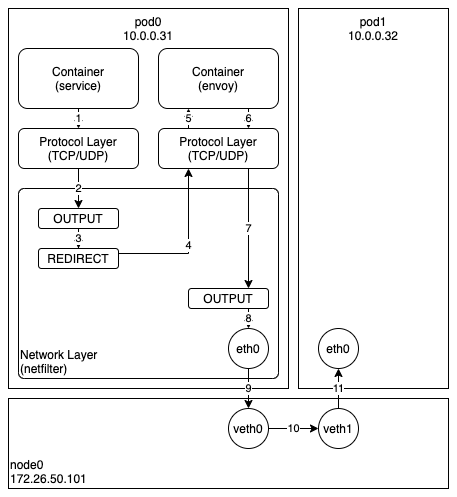

오늘은 Cilium 에서 소켓 기반 로드밸런싱을 이용할 때 발생하는 EnvoyProxy 사이드카 우회 문제에 대해 살펴보고자 한다. 이는 현재 모든 서비스 메쉬(Istio, Linkerd, ...)에서 서비스 IP 기반으로 동작하는 모든 필터를 우회하는 심각한 문제를 유발하고 있다. 왜 이런 문제가 발생했는지 살펴보고, 몇 가지 해결 방안을 소개하도록 하겠다.

우선 Cilium/Istio 에서 EnvoyProxy 사이드카가 동작하는 원리를 간단히 살펴보자. 아래 그림은 서비스 컨테이너에서 전송하는 패킷의 이동 경로(1-11번까지)를 간단히 표현한 것이다.

Iptables 를 이용하는 사이드카 기반의 모든 프록시가 대부분 비슷한 방식으로 동작하는데, 서비스 컨테이너에서 전송하는 모든 패킷은 Netfilter 에서 강제로 프록시(envoy) 컨테이너로 전달된다. 그리고 프록시 컨테이너에서 등록된 정책에 따라 해당 패킷을 드롭하거나, 지연시키거나, 변환한다. 이때 사용되는 정책은 헤드리스와 같이 특이한 경우를 제외하고는 모두 서비스 IP 를 기반으로 만들어진다.

다음으로 Cilium 에서 로드밸런싱이 일어나는 과정에 대해 간단히 살펴보자. 일반적인 로드밸런싱은 위 그림의 10번 단계에서 일어난다. Pod 내부의 네트워크 장치(eth0)와 VETH 로 연결된 호스트 네트워크 장치(veth0)의 ingress BPF 프로그램에서 서비스 IP 를 백엔드 IP 로 변환하여 패킷을 전달한다. 이는 모든 패킷에 대해 주소 변환 및 역변환 작업을 해야하는 문제가 있는데, 이를 해결하기 위해 나온 것이 바로 소켓 기반 로드밸런싱이다. 이는 위 그림의 2번 단계에서 소켓 시스템콜(connect, sendto)에 연결된 BPF 프로그램이 서비스 IP 를 백엔드 IP 로 변환하여 소켓의 목적지 주소를 미리 변경해놓는 방식이다. 이를 통해 매번 패킷의 목적지 주소를 변환/역변환하는 오버헤드를 줄일 수 있다.

이쯤되면 다들 눈치를 챘겠지만, Cilium 에서 소켓 기반 로드밸런싱을 이용할 경우 2번 단계에서 이미 서비스 IP 가 백엔드 IP 로 변환되었기 때문에 당연히 서비스 IP 기반으로 동작하는 프록시 컨테이너는 제대로 작동할 수가 없는 것이다.

이를 해결하기 위한 몇 가지 방법을 소개하도록 하겠다.

첫 번째로 지금 현재 바로 사용 가능한 방법은 소켓 기반 로드밸런싱을 아예 사용하지 않는 것이다. 약간의 오버헤드는 있지만 가장 간단하고 바로 사용 가능한 방법이다. 두 번째는 호스트에서만 소켓 기반 로드밸런싱을 사용하거나, 프록시 컨테이너를 사용 중인 Pod 에서만 소켓 기반 로드밸런싱을 사용하지 못 하게 하는 것인데 이는 아직 Cilium 개발자 커뮤니티에서 논의 중인 기능이기 때문에 당장은 사용할 수 없다. 세 번째는 프록시 컨테이너에서 변환 전의 서비스 IP 를 확인 할 수 있는 기능을 제공하는 것인데 이 또한 현재 Cilium 과 Istio/Linkerd 개발자들이 논의 중에 있다.

참고로, 첫 번째 방식을 사용할 때 주의해야 할 점이 있는데, KubeProxyReplacement 옵션이 probe 이거나 strict 이면 소켓 기반 로드밸런싱 기능은 해제가 되지 않는다. 해당 옵션을 꺼도 자동 탐지 기능에 의해서 다시 켜지니 주의하기 바란다.
