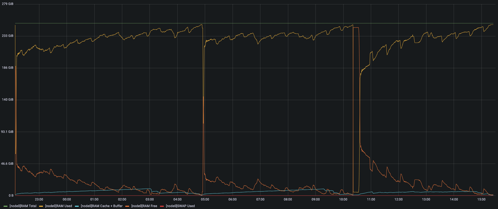
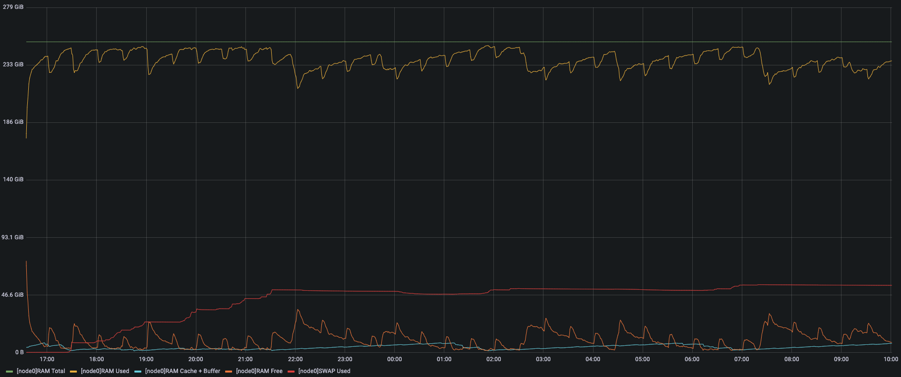
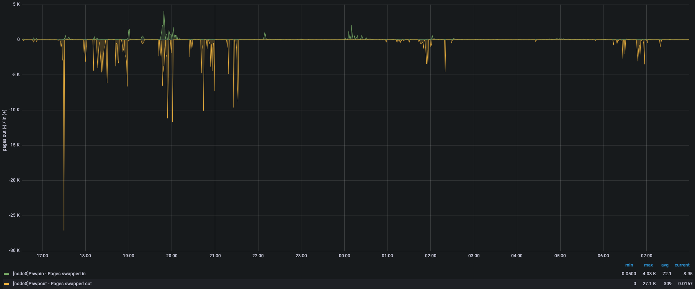

대표적인 빅데이터 처리 기술인 스파크(Spark)는 중간 결과를 하둡(Hadoop)처럼 디스크에 저장하지 않고 메모리에만 저장함으로써 놀랄만한 성능 개선을 가져왔다. 하지만 그만큼 메모리 사용량이 늘어났고, 메모리 관리를 어렵게 만들었다. 이는 다양한 서비스들과 스파크를 동시에 운영하는 쿠버네티스(K8S) 환경에서 더 심각한 문제가 될 수 있으며, 오늘은 최근 쿠버네티스에서도 지원하기 시작한 스왑(Swap)을 이용하여 이러한 문제를 어떻게 해결하였는지 소개하고자 한다.

우선, 리눅스 커널이 메모리를 어떻게 관리하는지 간단히 살펴보자.

## 페이지 캐시/버퍼 캐시

페이지 캐시는 파일의 데이터를 보관하는 메모리이고, 버퍼 캐시는 디렉토리의 파일 목록, 아이노드(Inode) 등을 보관하는 메모리이다. 이는 원본 데이터가 디스크에 있기 때문에 반환이 용이하다. 캐시가 수정되었을 때만 반영(Writeback)을 먼저 해야하고, 수정되지 않았을 때는 바로 반환할 수 있다.

## 익명 페이지

일반적으로 힙(Process/JVM Heap) 영역으로 사용되는 메모리이다. 메모리가 원본 데이터이기 때문에 스왑이 없으면 반환 자체를 할 수 없다. 스왑이 있으면 스왑 영역에 공간을 할당받아서 원본 데이터를 반영(Writeback)한 후 반환할 수 있다. 성능 개선을 위해 중간 결과를 메모리에만 저장하는 스파크가 가장 많이 사용하는 메모리이다.

## 커널 메모리

커널 스택, 페이지 테이블/디렉토리, 슬랩(Slab) 등 커널 내부에서 사용되는 메모리이다. 대부분 반환이 불가능한 메모리이지만, 페이지 캐시와 익명 페이지에 비해 사용량이 매우 적기 때문에 일반적으로는 크게 신경쓰지 않아도 된다.

다음으로, 쿠버네티스 환경에서 스파크를 운영할 때 메모리 관련해서 발생하는 다양한 문제들에 대해서도 한번 살펴보자.

## JVM OOM(Out-Of-Memory)

스칼라(Scala)로 개발된 스파크는 JVM 위에서 동작하기 때문에 JVM 이 사용할 최대 힙(Heap)의 크기를 지정해야 한다. 이 값이 실제 최대 사용량보다 작으면 OOM(JVM) 에 의해 해당 작업이 종료되고, 너무 크면 낭비되는 메모리가 많아질 수 있으니 적절한 값으로 설정하는 것이 중요하다.

## CGroup OOM(Out-Of-Memory)

스파크의 쿠버네티스 스케줄러는 익스큐터(Executor) 파드에 JVM 최대 힙 크기와 메모리 오버헤드 크기 등을 합쳐서 요청량(Requests)과 제한량(Limits)을 적용한다. 그래서 만약 해당 파드가 스왑 없이 익명 페이지를 메모리 한도보다 많이 사용한다면, OOM(CGroup) 에 의해 파드가 종료된다. 파드의 메모리 사용량이 많아지면 지속적으로 메모리를 반환하지만, 스왑이 없으면 익명 페이지는 반환되지 않기 때문이다. (스왑이 있으면 이론적으로는 OOM(CGroup) 은 발생하지 않는다.)

## Process OOM(Out-Of-Memory)

시스템의 물리 메모리가 부족해지면 커널에 의해 우선순위(oom_score)를 따라서 특정 프로세스가 종료(OOM)된다. 쿠버네티스는 QoS 정책에 따라 우선순위(oom_score_adj)를 지정하기 때문에, 서비스의 중요도에 따라서 QoS 정책을 잘 세워야만 최악의 상황은 면할 수 있다.

## K8S PodEviction

시스템의 물리 메모리가 지정된 값보다 작아지면, Kubelet 은 주기적으로 우선순위가 낮은 파드를 종료시킨다. 기본 설정값이 10 초마다 물리 메모리가 100 MBytes 이하일 때 파드를 추출하는 것인데, 우리의 실험 환경에서는 Kubelet 에 의해 파드가 추출되는 경우는 한번도 없었고 모두 커널에 의해 OOM 으로 종료되었다. 기본 설정값을 변경하거나 실험 환경이 다르면 다른 결과를 보일 수도 있겠지만, 이러한 환경에서는 현실적으로 실효성이 없다고 볼 수 있다.

## System Overload

스왑이 없으면 반환되지 않는 익명 페이지 사용량이 지속적으로 증가하면 페이지 캐시를 위한 메모리가 지속적으로 감소한다. 그리고 페이지 캐시가 줄어들면 프로세스가 파일에 접근할 때 디스크에서 다시 읽어들이는 경우가 많아지게 되고, 어느 순간 임계점을 넘어서면 CPU 와 디스크 사용량이 폭발적으로 증가하게 된다. 이 상황에서는 모든 프로세스가 정상적으로 동작할 수 있는 상황이 아니기 때문에, 우리의 실험 환경에서 주로 나타났던 현상은 스파크 익스큐터가 드라이버에게 하트비트(Heartbeat)를 제대로 전송하지 못해서 강제로 재시작되는 경우와 노드가 일정시간(PodEvictionTimeout) 이상 동작불능(NotReady) 상태가 되어 모든 파드가 추출되는 경우이다.

지금까지 설명한 문제들은 크게 두 가지로 나뉜다. 첫 번째는 파드(익스큐터)에 충분한 메모리를 할당하지 않아서 발생하는 문제들(JVM/CGroup OOM)이고, 두 번째는 전체 메모리 사용량이 시스템의 물리 메모리를 초과해서 발생하는 문제들이다. 두 가지 모두 근본적인 원인은 서비스가 사용하는 메모리를 정확히 계산/예측하는 것이 매우 어렵고, 최대 사용량 이상의 메모리를 할당해야 한다는 것이다. 그래서 문제가 발생하지 않을만큼 파드에 메모리를 할당하고 시스템에 물리 메모리를 추가하는 것이 일반적인 방법이지만, 이는 서비스가 지속적으로 재접근하는 메모리의 크기를 의미하는 워킹셋(WorkingSet)과 최대 메모리 사용량의 차이가 클수록 시스템의 활용률을 낮출 수 밖에 없다. 이를 개선하기 위해서는 꾸준히 재접근되지 않는 메모리를 반환해야 하는데, 스왑이 없으면 익명 페이지는 반환 자체를 할 수 없다.

스왑이 없으면 익명 페이지를 반환할 수 없는데, 왜 쿠버네티스는 그 동안 스왑을 허용하지 않았을까? 여러 가지 이유가 있겠지만, 과거부터 주로 언급되던 스왑의 문제는 전반적인 성능에 대한 불확실성을 높인다는 것이다. 하지만, 최근 디스크의 입출력 속도와 스왑 관련 리눅스 커널 코드가 많이 개선되었고, 다양한 사용자들이 꾸준히 요청해왔기 때문에 쿠버네티스에서도 공식적으로 스왑을 지원하게 되었다.

우선 스왑이 없는 환경에서 구체적으로 어떤 문제가 발생하는지 간단한 실험을 통해 살펴보자. 아래 그림은 노드의 허용량(Capacity)까지 스파크 스트리밍을 배포했을 때 반복적으로 노드가 동작불능 상태가 되면서 모든 파드가 추출된 상황을 보여주고 있다. (요청량(Requests)이 없는 파드때문에 실제 사용량은 요청량을 초과한다.)

스파크 스트리밍은 익명 페이지를 주로 사용하기 때문에 반환할 수 없는 메모리(노란색)가 지속적으로 증가하면서 페이지 캐시(하늘색)는 감소하는 모습을 볼 수 있다. 임계점(~05:00)에 가까워지면 시스템의 물리 메모리가 부족해져서 커널이 특정 프로세스를 종료(OOM)시키기도 하지만 바로 재시작하기 때문에, 결국 시스템은 과부하 상태가 된다. 그래서 임계점 직전에 CPU 와 디스크 사용량이 폭발적으로 증가하면서 노드가 동작불능(NotReady) 상태가 되었고, 잠시 후 모든 파드가 추출되면서 메모리가 반환되어 다시 동작가능(Ready) 상태가 되었다.

이제 스왑이 있는 환경에서 동일한 실험을 해보자. 아래 그림은 위와 마찬가지로 노드의 허용량까지 스파크 스트리밍을 배포했을 때의 상황을 보여주고 있다.

스왑이 없는 경우와 동일하게 익명 페이지 사용량이 지속적으로 증가하면서 페이지 캐시(하늘색)가 감소하지만 동시에 스왑 사용량(붉은색)도 증가하는 것을 볼 수 있다. 스왑 사용량은 어느 정도 증가하다가 더 이상 증가하지 않는 것을 확인할 수 있는데, 이는 간단히 말하면 LRU(LeastRecentlyUsed) 정책에 의해 오래 전에 사용된 페이지들을 우선적으로 스왑 아웃(SwapOut)해서 부족한 메모리를 확보했기 때문에 시스템이 안정적으로 메모리를 할당/해제할 수 있는 상황이 된 것이다.

이렇게 스왑을 사용해서 시스템은 안정되었지만, 성능적인 문제는 없었을까? 결론부터 말하면 성능 저하는 거의 없다고 할 수 있다. 위의 실험에서 성능은 스파크 스트리밍의 마이크로배치 처리시간으로 검증하였는데, 실제 성능 차이는 전혀 없었다. 그렇다면 왜 성능 차이가 전혀 없을까? 여러 가지 이유가 있겠지만, 가장 중요한 이유는 아래 그래프를 보면 알 수 있다.

위의 그래프에서 보면, 스왑 사용량이 증가할 때(~21:30)는 스왑 아웃(SwapOut)이 꽤 많아보이지만, 이후로는 거의 없어졌다. 즉, 다시 물리 메모리가 부족해져서 스왑을 이용하여 추가 메모리를 확보할 필요가 없어졌다는 의미이다. 그리고 위의 그래프에서 더 중요한 부분은 바로 스왑 인(SwapIn)이 매우 적다는 것이다. 이는 스왑 아웃되었던 페이지를 다시 접근하여 스왑 인되는 상황이 매우 적었다는 말이다. 즉, 다시 접근할 일이 없는 페이지를 잘 골라서 추가 메모리를 확보했다는 의미이다. 이러한 이유로 성능 저하는 거의 없었다고 보면 된다. (하지만, 무리하게 스트리밍을 더 늘리면 어느 시점부터는 스왑 인/아웃이 동시에 증가하면서 성능 저하가 나타나기 시작한다.)

스왑이 좋은 효과를 볼 수 있는 상황은 최대 메모리 사용량이 물리 메모리보다 크지만 워킹셋은 물리 메모리보다 작은 경우이다. 이는 반복적으로 사용되는 메모리(워킹셋)는 물리 메모리를 항상 차지하고 있는 것이 유리하고, 더 이상 사용되지 않는 메모리는 스왑 아웃되어 물리 메모리를 차지하지 않는 것이 유리하기 때문이다.
