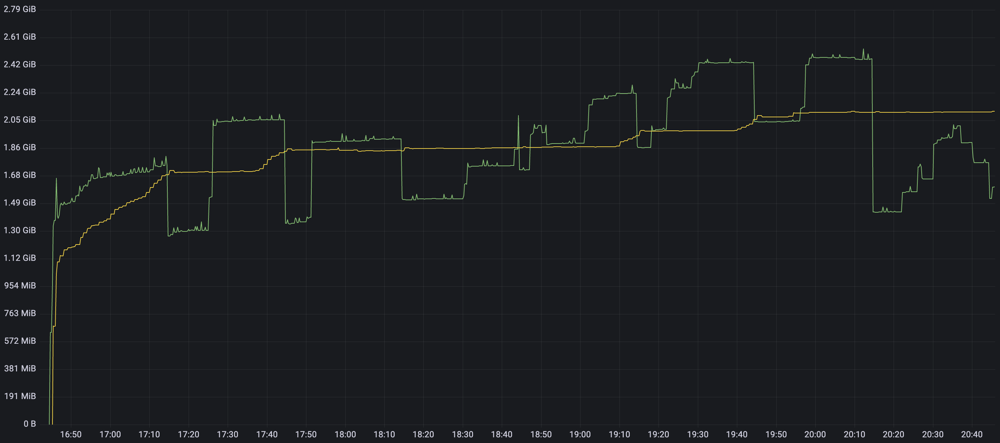
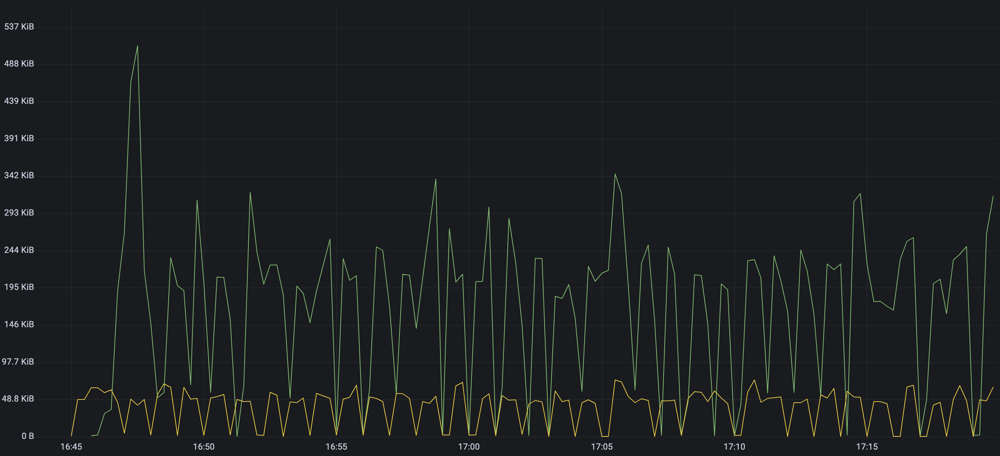
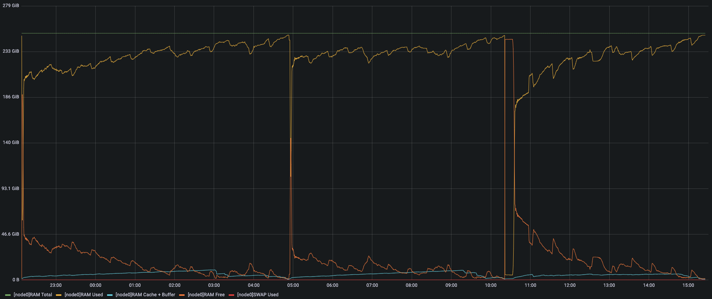
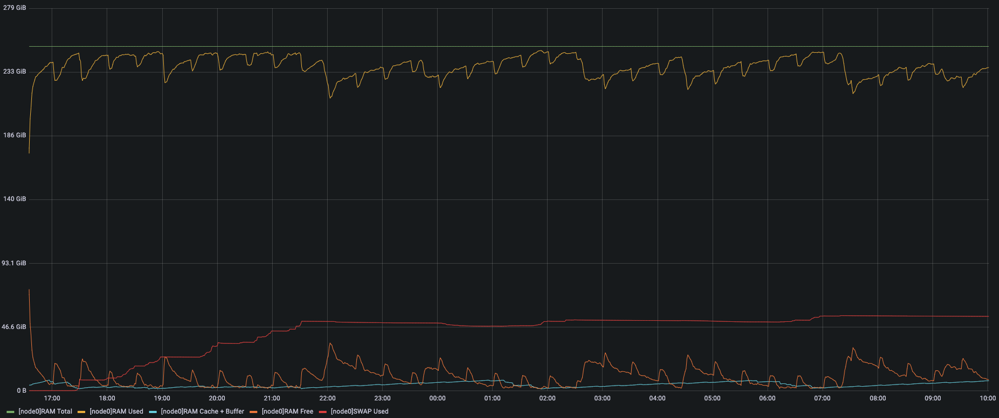
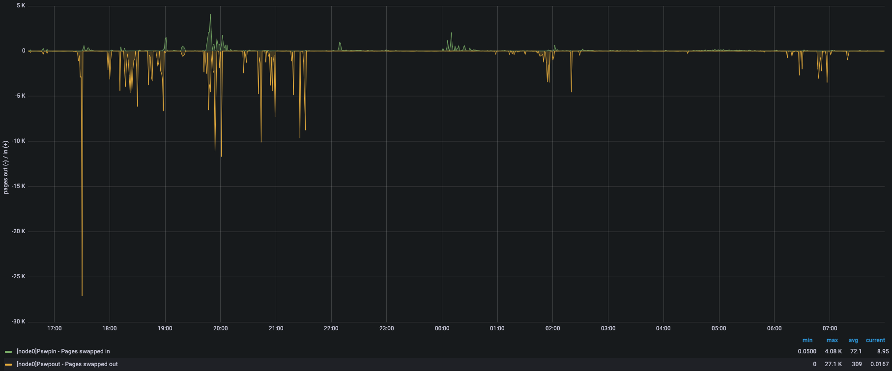

우리는 다양한 클라우드 환경을 효율적으로 지원하기 위해 쿠버네티스(K8S)를 기반으로 데이터 플랫폼을 개발 중이고, 하나의 클러스터에서 카프카(Kafka), 스파크(Spark), 트리노(Trino) 등 다양한 서비스들을 동시에 운영하고 있다. 이는 각각의 서비스를 베어메탈(BareMetal) 환경에서 독립적으로 운영하는 것보다 많은 고민과 노력이 필요하고, 오늘은 이러한 환경에서 스파크를 어떻게 최적화해서 사용하고 있는지 몇 가지만 간단히 소개하고자 한다.

우선, 어떠한 점들을 중요하게 고려하고 있는지 간단히 정리해보도록 하겠다.

- 컴퓨팅 자원이 부족한 엣지 클라우드
- 안정적인 실시간 데이터 수집/보관/처리

보안이 중요한 고객들은 회사 내부에서 클라우드를 직접 운영하는 온프레미스 환경을 선호하기 때문에 컴퓨팅 자원이 부족할 수 밖에 없고, 이러한 환경에서도 안정적으로 실시간 데이터를 수집/보관/처리할 수 있어야 한다.

## GraalVM 을 이용한 물리 메모리 사용량 줄이기

쿠버네티스는 기본적으로 스왑(Swap)을 사용하지 않기 때문에 익명 페이지(AnonPage)를 사용하는 힙(Heap)은 반환(Reclaim)되지 않는다. 그렇기 때문에 스파크에 너무 많은 양을 할당하면 메모리 활용률이 낮아질 수 밖에 없다. 그렇다고 충분한 양을 할당하지 않으면 OOM 이 발생할 수 있기 때문에 약간의 활용률은 희생할 수 밖에 없는 상황이다. 이를 개선하기 위해, 오라클에서 개발 중인 GraalVM 을 적용해보았다. GraalVM 은 기존의 C++ 로 개발되던 자바가상머신(JVM)을 자바로 개발한 것이고, 주요 기능 중 하나가 필요없어진 힙 영역을 커널에 반환하는 기능이다. 간단히 설명하면, 기존에는 GC(GarbageCollection) 에 의해 사용되던 힙이 반환되어도 커널에 반환하지 않았지만, GraalVM 은 GC 에 의해 사용되던 힙이 반환되면 커널에 반환까지 한다. (물론, 자바가상머신에서 사용하는 힙 영역은 익명 페이지를 할당받아서 사용하기 때문에 최소한 페이지 단위로 할당/반환이 이루어진다.)

위의 그래프는 동일한 작업을 하는 스파크 익스큐터(Executor)를 각각 OpenJDK 와 GraalVM 으로 실행했을 때 실제 물리 메모리 사용량인 RSS(Resident Set Size) 를 측정한 결과이다. 비슷한 시점에 MajorGC 가 발생하지만 OpenJDK(노란색) 는 RSS 가 줄어들지 않고 GraalVM(연두색) 은 RSS 가 줄어드는 것을 확인할 수 있다. 하지만, 최대 힙 사용량은 GraalVM 이 더 높기 때문에 유의해서 사용하는 것이 좋을 것 같다.

## TmpFS 를 이용한 디스크 쓰기 줄이기

스파크는 셔플(Shuffle)을 이용하여 데이터를 재분배할 때 로컬 디렉토리(LocalDir)에 셔플을 위해 준비한 데이터 파일을 저장한다. 해당 데이터 파일은 작업이 종료된 후 GC 에 의해 셔플 객체가 반환될 때 같이 지워지는데, 데이터 파일이 지워지기 전에 (커널의 기본 설정에 의해) 페이지 캐시가 반영(Writeback)되어 불필요한 디스크 쓰기가 주기적으로(마이크로배치 간격으로) 발생하였다. 이를 해결하기 위해 로컬 디렉토리로 메모리 기반 파일시스템인 TmpFS 를 사용하였고, 결과는 아래와 같다.

위의 그래프에서 볼 수 있는 것처럼, 로컬 디렉토리로 Ext4FS(연두색) 를 사용한 경우에는 마이크로배치(1 분)마다 200~300 KBytes 정도의 디스크 쓰기가 발생하였고, TmpFS(노란색) 를 사용한 경우에는 동일한 상황에서 80 KBytes 미만의 디스크 쓰기가 발생하였다. 이는 입력 데이터의 크기가 커질수록 셔플에 사용되는 데이터 파일의 크기가 커지기 때문에 심각한 문제를 발생시킬 수 있다.

## 스왑을 이용한 물리 메모리 활용률 높이기

컴퓨팅 자원을 최대한 활용하기 위해 노드의 허용량(Capacity)까지 스파크 스트리밍을 배포해보았다. 노드에 설치된 메모리가 256 GBytes 이기 때문에 하나의 드라이버(4 GBytes)와 하나의 익스큐터(7 GBytes)로 구성된 스트리밍을 총 35 개 정도 배포할 수 있었다. 스파크의 쿠버네티스 스케줄러는 익스큐터 파드에 요청량(Requests)과 제한량(Limits)을 적용하기 때문에 노드의 용량 초과로 더 이상 배포할 수는 없었다. 그러나 노드가 허용하는 범위 내에서 파드를 성공적으로 배포했지만, 노드는 아래와 같이 불안정한 모습을 보였다.

해당 노드에는 요청량이 없는 여러 파드도 동작 중이기 때문에 실제 총 사용량은 총 요청량을 초과할 것이다. 그리고 쿠버네티스는 기본적으로 스왑을 사용하지 않기 때문에 대부분의 공간을 차지하는 익명 페이지는 반환이 불가능하다. 그래서 위의 그래프를 보면 페이지 캐시 사용량(하늘색)이 감소하다가 0 에 가까워지면 더 이상 추가 메모리를 확보할 수 없게 되면서 시스템이 불안정해진다. 위의 경우는 시스템이 불안정해지면서 노드가 동작불능(NotReady) 상태가 되고, 이 상태가 일정시간(PodEvictionTimeout) 이상 지속되면 해당 노드의 모든 파드가 추출되어 파드가 사용 중이던 메모리가 반환되면서 다시 노드가 동작가능(Ready) 상태가 된 것이다. 이러한 반복적인 상황을 해결하기 위해 실제 총 사용량을 어느 정도 예측하여 파드를 적절히 배포하면 좋겠지만, 다양한 워크로드가 혼재되어 있는 상황에서 총 사용량을 정확히 예측하기란 불가능에 가깝다.

우리는 이 문제를 효율적으로 해결하기 위해 쿠버네티스 1.22 버전부터 지원하기 시작한 스왑 기능을 사용하기로 하였다. 지금까지 쿠버네티스에서 스왑을 지원하지 않았던 이유는 부족한 메모리 대신 느린 디스크를 사용하는 것이 오히려 더 많은 문제를 만든다고 보았기 때문이다. 하지만, 최근 리눅스 커널에서 스왑 관련 기능이 많이 개선되었고, 랜덤 읽기/쓰기 속도가 매우 빠른 SSD 와 NVME 가 일반적으로 널리 쓰이면서 스왑 사용 여부를 사용자가 선택할 수 있는 기능이 추가되었다. 아래는 스왑을 사용하여 위의 실험을 다시 해본 결과이다.

위의 그래프를 보면, 메모리 사용량이 증가하면서 페이지 캐시(하늘색)가 반환되지만 동시에 스왑 사용량(붉은색)도 증가하는 것을 볼 수 있다. 스왑 사용량은 어느 정도 증가하다가 더 이상 증가하지 않는 것을 확인할 수 있는데, 이는 간단히 말하면 LRU(LeastRecentlyUsed) 정책에 의해 오래 전에 사용된 페이지들을 우선적으로 스왑 아웃(SwapOut)해서 부족한 메모리를 확보했기 때문에 시스템이 안정적으로 메모리를 할당/해제할 수 있는 상황이 된 것이다.

이렇게 스왑을 사용해서 시스템은 안정되었지만, 성능적인 문제는 없었을까? 결론부터 말하면 성능 저하는 거의 없다고 할 수 있다. 위의 실험에서 성능은 스파크 스트리밍의 마이크로배치 처리시간으로 검증하였는데, 실제 성능 차이는 전혀 없었다. 그렇다면 왜 성능 차이가 전혀 없을까? 여러 가지 이유가 있겠지만, 가장 중요한 이유는 아래 그래프를 보면 알 수 있다.

위의 그래프에서 보면, 스왑 사용량이 증가할 때(~21:30)는 스왑 아웃(SwapOut)이 꽤 많아보이지만, 이후로는 거의 없어졌다. 즉, 다시 물리 메모리가 부족해져서 스왑을 이용하여 추가 메모리를 확보할 필요가 없어졌다는 의미이다. 그리고 위의 그래프에서 더 중요한 부분은 바로 스왑 인(SwapIn)이 매우 적다는 것이다. 이는 스왑 아웃되었던 페이지를 다시 접근하여 스왑 인되는 상황이 매우 적었다는 말이다. 즉, 다시 접근할 일이 없는 페이지를 잘 골라서 추가 메모리를 확보했다는 의미이다. 이러한 이유로 성능 저하는 거의 없었다고 보면 된다. (하지만, 무리하게 스트리밍을 더 늘리면 어느 시점부터는 스왑 인/아웃이 동시에 증가하면서 성능 저하가 나타나기 시작한다.)

스왑이 긍정적인 효과를 내기 위해서는 지속적으로 재접근되는 메모리의 크기를 의미하는 워킹셋(WorkingSet)이 중요한데, 전체 메모리 사용량은 물리 메모리보다 크지만 워킹셋이 물리 메모리보다 작다면 스왑이 좋은 효과를 볼 수 있다. 이는 반복적으로 사용되는 메모리(워킹셋)는 물리 메모리를 항상 차지하고 있는 것이 유리하고, 더 이상 사용되지 않는 메모리는 스왑 아웃되어 물리 메모리를 차지하지 않는 것이 유리하기 때문이다.
